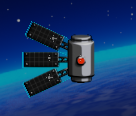
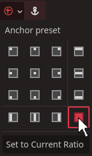

# WASTE INVADERS
## 2D beginners track

Waste Invaders is a 2D shooter where you pilot a waste management spaceship tasked with shooting down garbage raining down on the earth. It is a simple 2D project which is ideal to learn the game development pipeline from start to finish.

We cover everything from how to set up your first project and scene, all the way to exporting your finished product. You can follow along, with assets we have provided or make your own. Either way you'll have a lot of fun learning how to make this exciting game.

## Just Starting?

You may wish to look at our tutorial, [Learn your way around Redot](/pages/tutorials/learn-way-around-redot).
This is an easy short summary of the naming conventions for different parts of the editor. Check it out at your convenience, and then return to this track.

If you're just beginning, follow the tutorial on how to make your first project and create your first scene with `Redot` And then come back to this track.
::: info recommendation
We recommend that you name your project something similar to 'waste invaders'
unless you have a cool name in mind.
:::
[Create your first project](/pages/tutorials/create-your-first-project)\
Once we have set up our project we will want to create our first scene, to learn how to do this, follow the tutorial below and return to this track when you are ready.\
[Create your first 2D scene](/pages/tutorials/set-up-initial-2d-scene)
Creating our first scene is the first step in the door towards our finished game. Though a small step, remember;

_One who moves a mountain begins by carrying away small stones._

## 2D World Essentials
Our first scene will need a few things before our game will run. Initially most 2D games need the following:
* a useable screen resoultion
* a 2D camera
* an awesome background

### 2D Resolution and Camera

To setup our first camera and screen resolution you should follow the [Setup 2D Camera Tutorial](/pages/tutorials/2d-camera-setup), then return to this track.

Because we are making our game for PC, we should set the viewport resolution to `1920x1080` as shown in the tutorial above. The camera will give the player something to see our cool game world through, but right now there isn't much to see. For that we need a background.

### Choosing a background

The background in 2D games is very important. Our game can use anything from just a block of color, a photograph of a blowing desert scene, or the earth and stars like our example asset.


Feel free to use our background asset above by shrinking your browser to a smaller window, and while on our website, drag the image from the browser into the `Redot` `FileSystem` bottom left.


It may come with a strange name, so rename it to anything you like.

If choosing your own image, you will want it to be the same size as your screen resolution, so there are no blacklines down the sides or stretching going on. Once you've chosen a suitable background and added it to the `Redot` `file system`, we need to add it to our scene.

### Adding and adjusting our background

In Waste Invaders, our camera will not move, and neither will our background, so using a single `sprite2D` for our background will suffice.
To add our background sprite and learn more about sprites, check out this tutorial, [A Quick Word On Sprites](/pages/tutorials/a-quick-word-on-sprites) then return to this track.

once our `background` sprite is created, image assigned, and the `centered` box is checked, we can take a first look at our game.

Press play above the inspector top right to run a test of the game.


If all was setup correctly, we should see the background sitting perfectly inside our viewport window.
If so, congratulations! Your game has run successfully for the first time!

## Our First Lines of Code

Now we have the basics set up and ready for play, we need some functionality in the form of code. For our game we will need two specific managers.

* A `GameManager` to handle our gamestate, creating new games, and choosing levels
* A `LevelManager` to handle what happens in each level of our game.

Both of these managers will be a type of script, but differ slightly with implemention.

### The Game Manager

 A good way to get started is to look into the GameManager tutorial. This will help you set up our two manager scripts that will be essential to our game's function.

Once you've followed all you can in the [GameManager Tutorial](/pages/tutorials/game-managers), return to this track.
If you haven't already added the `GameManager` to the `Autoload` system, follow this tutorial [Autoloading scripts](/pages/tutorials/autoload) then return here. 

You can open your `GameManager` script by double-clicking it in the `file system`, in the bottom left. This script will automatically come with some functional code already in it, as shown below.\
::: code-group
```gdscript [GameManager.gd]
extends node#[!code ++]


# Called when the node enters the scene tree for the first time.#[!code --]
func _ready() -> void:#[!code --]
	pass # Replace with function body.#[!code --]


# Called every frame. 'delta' is the elapsed time since the previous frame.#[!code --]
func _process(delta: float) -> void:#[!code --]
	pass#[!code --]

```
:::
Our game will not require most of this code, so you can delete everything in red, but leave the first line that says `extends node`.


From here we want to add these two lines of code, highlighted in green below:

::: code-group
```gdscript [GameManager.gd]
extends node


var isGameRunning : bool = false#[!code ++]
var level : int = 0#[!code ++]
```
```c# [GameManager.cs]
Using Godot;
Using system;


public partial class GameManager : Node
{
	public bool isGameRunning = false;//[!code ++]
	public int level = 0;//[!code ++]
}
```
:::

Our two lines of code achieve the following:
* `isGameRunning` - will be our gamestate, we only really need to know if the player and enemies can move or not.
* `level` - this is the level number, our game will create enemies on levels 1 - 5, but 0 will be our mainmenu

### Level Manager

Next lets open the `LevelManager`. Just like we did with our `GameManager` script, delete all the code there except for the top line. Then add these lines of code, highlighted in green below:

::: code-group
```gdscript [LevelManager.gd]
extends Node

const playerOrigin : Vector2 = Vector2(0, 465)#[!code ++]
const enemyOrigin : Vector2 = Vector2(0, -830)#[!code ++]
```
:::

These two lines state where the player and enemies are going to start the game. The `x:0` for both is the centre of the screen. The Player's `y:465` is around the bottom of the screen. 

The enemies `y:-830` is quite far above the top of the screen. This is on purpose so enemies spawn out of sight, and fall into the screen like they're breaching the earth's atmosphere.

Excellent work!\
We now have a working gameState so we can tell whether the game is playing or not. We know the level we are on, and we know where the player and enemies are going to start.

## The Player - Fearless Fighter of Trash

The time has come to add our player into the game. We are going to need to do a few things to accomplish this.
* create a new 2d player character
* create the death sprite of our player
* give our player functional code

### Create a New 2D Player
We have a great tutorial on how to get a 2D player started with controls and all, so head over and check that out, before returning to the track. [2D Player Tutorial](/pages/tutorials/player-controller-2d)

We have supplied a few art assets if you wish to use these for your player Sprites.


You can drag these into your projects `file system`, the same way you did with the background image asset.

### The Players Death
Once you have created the basic player character from the tutorial, we're going to make a few changes specific to `Waste Invaders`

First, we shall want a death sprite for our player, right-click the `playerSprite` and select duplicate.


After the new `playerSprite2` appears, rename it to ***dead_sprite***. When we create code for this later, the image will flash for a quarter of a second when the player dies. There is an art asset we have provided of an explosion you can use.

Once done, click to ***hide*** the `dead_sprite`. It is a small round white open eye circle, just after the name. It looks like a closed eye when its hidden.


Next we want to add in the `Dead()` function which we can call for in code if our player ever falls in battle.

Just above the `_physics_process()` function add the following line of code:
::: code-group
```gdscript [player.gd]

func Dead():#[!code ++]
	$main_sprite.hide()#[!code ++]
	$dead_sprite.show()#[!code ++]
	await get_tree().create_timer(0.25).timeout#[!code ++]
	$dead_sprite.hide()#[!code ++]


	func _physics_process(delta: float) -> void:
	# rest of code below
```
:::
This code does the following:
*	hides the `main_sprite` and reveals the `dead_sprite`
*	`Await` a quarter of a second, and then hides the `dead_sprite` so the player appears gone from the game.

### Some functional code for our Player

Next we need to modify the code in our player script. There are threee main reasons for this:
* Waste Invaders is in space and gravity will not affect the player.
* The player will be moving along the x-axis and not up and down
* The player is a spaceship and will not use the 'jump' function

You'll need to delete about half of the code in player.gd. Shown below, we need to keep the green highlighted code, while removing the red.

::: code-group
```gdscript [player.gd]
extends CharacterBody2D#[!code ++]


const SPEED = 300.0#[!code ++]
const JUMP_VELOCITY = -400.0#[!code --]


func Dead():
	$main_sprite.hide()
	$dead_sprite.show()
	await get_tree().create_timer(0.25).timeout
	$dead_sprite.hide()


func _physics_process(delta: float) -> void:#[!code ++]
	# Add the gravity.#[!code --]
	if not is_on_floor():#[!code --]
		velocity += get_gravity() * delta#[!code --]

	# Handle jump.#[!code --]
	if Input.is_action_just_pressed("ui_accept") and is_on_floor():#[!code --]
		velocity.y = JUMP_VELOCITY#[!code --]

	# Get the input direction and handle the movement/deceleration.#[!code --]
	# As good practice, you should replace UI actions with custom gameplay actions.#[!code --]
	var direction := Input.get_axis("ui_left", "ui_right")#[!code ++]
	if direction:#[!code ++]
		velocity.x = direction * SPEED#[!code ++]
	else:#[!code ++]
		velocity.x = move_toward(velocity.x, 0, SPEED)#[!code ++]

	move_and_slide()#[!code ++]
```
:::
This should give our player a steady left and right movement with the left and right arrow keys. Its about time we tested this, so to do so we need to open the `LevelManager` script.

We're going to add the lines of code highlighted below.

::: code-group
```gdscript [LevelManager.gd]
extends Node

var playerScene : PackedScene = preload("res://player.tscn")#[!code ++]

var playerOrigin : Vector2 = Vector2(0, 465)
var enemyOrigin : Vector2 = Vector2(0, -830)

func _ready() -> void:#[!code ++]
    CreatePlayer()#[!code ++]

func CreatePlayer():#[!code ++]
	var player = playerScene.instantiate()#[!code ++]
	player.position = playerOrigin#[!code ++]
	add_child(player)#[!code ++]

```
:::
To explain this code a little, this is what these new lines of code accompish.
* The `var playerscene` holds a copy of the player scene we created earlier so it can be called up at runtime.
* The `_ready()` functions calls the `CreatePlayer()` function right after our `Main` node enters the scenetree at runtime.
* Creates the `playerScene`, and adds it to the scene in the position we have set.

As mentioned in the `GameManager` tutorial, the `GameManager` initiates the start of a level, but it is the `LevelManager` that creates a new player at the start of each level.

If we run our game we should see our player at the bottom of the screen and be able to move them right and left with the arrow keys.

## Guns! Guns! Guns!

Now we are ready to give our player some weapons. We are going to need to do three things to accomplish this.

* Create a 2d projectile to fire at enemies
* Make code to instantiate the projectiles when `fire` is pressed
* Make code for enemies to react to being hit by projectiles

### Create 2d projectile
Before we program our player to fire their weapon, we do need something for our weapon to shoot. We have an simple tutorial here,
[Simple 2D Projectile](/pages/tutorials/simple-2d-projectile) that should give you the basics on projectiles, once you've followed that tutorial return here.

### Code for our weapon
Now we have something to fire out of our barrel, let us create the code to accomplish this. 

Firstly we need to create a function inside the player script to create a new projectile.

Add this line in green to the top of our `player` script.
::: code-group
```gdscript [player.gd]
extends CharacterBody2D

var bulletScene = preload("res://bullet.tscn")#[!code ++]

const SPEED = 300.0
# rest of script hidden below#
```
:::
This line of code holds our projectile in a variable, so we can call upon it multiple times at runtime. Next we need to add some variables to our script to control the rate of fire of our weapon.
::: code-group
```gdscript [player.gd]
extends CharacterBody2D

var bulletScene = preload("res://bullet.tscn")

const SPEED = 300.0
var elapsed = 0.0#[!code ++]
var firerate = 0.75#[!code ++]
# rest of script hidden #
```
:::
This code does the following:  
*	`elapsed` variable is the amount of time passed since the weapon was last fired at runtime.
*	`firerate` will be the threshhold which `elapsed` reaches in order to fire again.

#### The Fire Function

Next we need a function that will be called when we pressed the `fire` button.

Add these lines of code to the player script
::: code-group
```gdscript [player.gd]
extends CharacterBody2D

var bulletScene = preload("res://bullet.tscn")

const SPEED = 300.0
var elapsed = 0.0
var firerate = 0.75


func Fire():#[!code ++]
	elapsed = 0.0#[!code ++]
	var bullet = bulletScene.instantiate()#[!code ++]
	bullet.position = Vector2(position.x, position.y - 70)#[!code ++]
	bullet.rotation = rotation#[!code ++]
	get_parent().add_child(bullet)#[!code ++]

# rest of script hidden below#
```
:::
This new function accomplishes the following:
* sets `elapsed` back to 0, so it can begin counting up again.
* instantiates the `bulletScene` we created previously making an instance of it.
* places the bullet at the players position, with the `-70` making it slightly offset ahead of our spaceship.
* sets bullet rotation to be the same as the players.
* sets the bullet as a child of `Main`, without doing this it will remain outside the scenetree and never be seen.

#### Weapon Sound Effects

Now this part is optional, but sound makes even the simplest game come alive and `Redot` makes it so easy.

If you have your own effect, you can use that if you wish. Otherwise you can get our laser shot sound by clicking the link below.

[SOUND EFFECT : laser shot](../../assets/images/2d-wasteInvader/lasershot.wav)

Once you have the sound file downloaded. You can easily minimize your download folder, and drag the sound file into the `Redot` `filesystem`. Like so:


Adding this sound to our player is almost as easy as that was. Select your `player` scene above the toolbar. Click the sound file in the `file system` and drag it above into the scene tree on top of the `player` node. 
This will add the sound file into the player scene and we can access it through code. 

Now we will show you one of the best features of the `Redot` engine. If you open your `player` script, we can actually drag this new sound file from the scene tree over into our code, like the example below:


You'll see the new line of code that represents the sound is like this:
::: code-group
```gdscript [player.gd]
$Lasershot
```
:::
All we have to do is add ***.play()*** after it and the sound will be played every time we call this function.
::: code-group
```gdscript [player.gd]
$Lasershot.play()
```
:::
#### Weapon Controls

Our last task is to set the weapon to fire by pressing the space bar, which `fire` is set to automatically. In our player script We need to add a line inside the `_physics_process` function. You can see an example of what to add below.
::: code-group
```gdscript [player.gd]
# rest of script hidden above#
func _physics_process(delta: float) -> void:

	if GameManager.gameStarted:
		elapsed += delta#[!code ++]		
		if Input.is_action_pressed("fire"):#[!code ++]
			if elapsed > firerate:#[!code ++]
				Fire()#[!code ++]
		
		var direction := Input.get_axis("ui_left", "ui_right")
		
		if direction:
			velocity.x = direction * SPEED
		else:
			velocity.x = move_toward(velocity.x, 0, SPEED)
				
		position.y = get_parent().playerOrigin.y
		
		move_and_slide()
```
:::
These new lines if code achieve the following:
* sets `elapsed` to have the `delta` added to it every physics frame
* `Input` checks if the spacebar has just been pressed
* our `if` statement makes sure `elapsed` has reached the threshold to fire
* If `elapsed` is above the `firerate`, the function `Fire()` is called

If you play the game now you should see projectiles everytime you press the spacebar or `fire` key.

## Friendly Starbases

In the original space invaders, five bunkers act as defensive structures that intercept both player and enemy fire.

Since we are making `Waste Invaders`, we're going to use eco-friendly solar starbases instead.

### Create a Destructible
We will want parts of our starbases to be destructible, and we just happen to have an awesome static destructables tutorial which you can see here, [2d destructables](/pages/tutorials/simple-2d-destructible). Once you have built a destructible, return to this track.

We need to make a few changes before we start using them in our level.

First assign this image to our destructable's `main_sprite`.


You will need to adjust the shape of the `CollisionShape2D` of the destructible, until it looks like the example below.


Next we need to alter a few lines of the destructibles code.
Open the destructibles script and alter the `Hit()` function to the green code line below
::: code-group
```gdscript [destructible.gd]
	func Hit():#[!code --]
	func Hit(playerShot : bool):#[!code ++]
```
:::
Even though our destructible won't use the `playershot` boolean, the projectile expects the argument to be there. The `hit()` call might create an error otherwise.

### Creating our starbases
Now that we have a basis for our solar panels, Let's build our first complete starbase. 

We'll start by constructing a `Node2D`. Right-click the `Main` node and select `Add Child Node`. In the `Create New Node` panel, type ***node*** into the serach bar. Select `Node2d` when it appears, and then click `Create`.


For the tutorial we will rename the `node2d` to ***starbase***. This node will act as a container of sorts to keep all of our solar panels together.

#### Positioning the Starbase

You can manually drag the `starbase` to the bottom of the screen, but an easier and more accurate way is to alter its position.

We can do this by selecting the `Starbase` in the `scene-tree`, then in the `Inspector` on right side of the screen, you will see a panel in the `Inspector` called ***node2D***


This holds the transform, which has all the position information we will need to alter. under `position` change the `x` to -600 and the `y` to 340.

:::info info
You may recall when we set the games resolution at the beginning of the tutorial. The position numbers we use will 
determine if the object is or is not in view of our `camera2D`.
:::
#### Starbase Center
Next select the `starbase` node and right-click, and as we just did with the `node2d`, create a child `Sprite2D` node.

You can use this image below or use your own design. Drag it into the `filesystem` and then assign it to the `sprite2D` now.

Don't forget, you can always check out, [A Quick Word On Sprites](/pages/tutorials/a-quick-word-on-sprites)

### Starbase panels
Now for our first solar panel, drag a `destructible.tscn` scene from the `filesystem` in the bottom left and drop it ontop of the `starbase` node in the scene-tree. 

This will create an instance or copy of our destructible within the current level and make it a child of the `starbase`.

Do this until you have three solar panels.

To position the solar panels, select one, then in the `Inspector` under `node2D` alter its ***position*** to the settings below.

For first panel make `x` -40 and leave `y` as 0. Set the rotation as 0\
For the second make `x` -40 and `y` as 25. Set the rotation as -25\
For the Third make `x` -40 and `y` as -25. Set the rotation as 25

Our starbase should look like this


now drag three more destructibles onto the star base and give them these positions and rotations.

For first panel make `x` 40 and leave `y` as 0. Set the rotation as 180\
For the second make `x` 40 and `y` as -25. Set the rotation as 155\
For the Third make `x` 40 and `y` as 25. Set the rotation as 205

If your centre appears behind the solar panels, you may have to change the order of child nodes in the `scene-tree`. You can drag them up and down to change. 

The final order in the `scene-tree` should look like this:


Now we have all six panels, we can give them a slight tilt, if you like. Select each and in the inspector you will find `skew` under `rotation`. For the left side panels set `skew` as 20, for the right side change it to -20.

The final result should look like this.


Our starbase is complete. The final thing we need is four more of them. To duplicate our starbase, select it in the scene tree, then right-click. In the options shown, select duplicate. Do this three times.

In the scene-view you will see all four starbases stacked on top of one another, called starbase, starbase2, starbase3, starbase4. We will assign them each the following positions:

Leave the first starbase position where it is.\
Starbase2 set position `x` as -230, `y` as 300.\
Starbase3 set position `x` as 180, `y` as 300.\
Starbase4 set position `x` as 500, `y` as 350

That is all for our friendly starbases, if you run the game now you'll notice the starbase panels can be destroyed by our player's fire, so be careful.

## Enemies Incoming!

Now it is time to add the enemies to our game. In `Waste Invaders` balls of trash are rainning down upon the earth. Some trash has gotten so rotten, they've grown tenticles and capable of firing projectiles at us.

We are going to create four different enemies for our game, each with their own abilities and value in points.

### Enemy one - Usual trash

For each enemy we are going to need a scene so we can create as many enemies as we want upon starting the game.

To begin lets create a new scene. When selecting the type of scene select `Other Node`.


When presented with the `Create New Node` panel, type ***character*** into the search bar.

When you see the option for `CharacterBody2D` appear, select it and click the `Create` button.

Select the `characterbody2d` and rename it if you like, we should call our first enemy ***usual_trash***, then save the scene as the same name.

We will use this image below for our enemy or else feel free to use your own.


Now if you recall our tutorial on 2D destructibles, the next few steps will be familiar. Our enemy will need the following added as child nodes of the `usual_trash` node.
* Sprite2D - rename as ***main_Sprite***
* Sprite2D - rename as ***dead_sprite*** click hide icon next to name
* CollisionShape2D - assign shape `CircleShape2D` and resize to cover our `main_sprite`

It should look as follows within the scene tree


Lastly we need to give our enemy some code. Right-click the `usual_trash` node and click ***attach script***. Name the script ***enemy*** as we shall use this same script for all enemies within our game.

#### Usual Trash - Variables

Firstly lets start at the top of our script. We will need to remove the variables there and add following in green.
::: code-group
```gdscript [enemy.gd]
extends characterBody2D

@export var points : int = 10#[!code ++]

var active : bool = false#[!code ++]
var isFalling : bool = false#[!code ++]
var moveSpeed : float = 40.0#[!code ++]
var rotationSpeed : float = 1.0#[!code ++]
var direction : Vector2 = Vector2(-1, 0)#[!code ++]

const SPEED = 300.0#[!code --]
const JUMP_VELOCITY = -400.0#[!code --]

# rest of script below
```
:::
This is what our new variables will allow for our enemy:
* `points` will be awarded every time we eliminate one of these units. `@export` is useful as it allows us to set this in the `Inspector` for different enemies.
* `active` is useful when we want to enemy to start moving and interacting with the game
* `isFalling` is used when an enemy reaches the sides of the screen and drops down a level.
* `moveSpeed` is the movement speed we will set for our enemy
* `rotationSpeed` will set the speed for our `main_sprite` to rotate (entirely aestheic)
* `direction` this is so the enemy knows to move left or right.

:::info Important
You may notice we replaced ***const SPEED*** for ***var moveSpeed*** and wondered, why? The ***Speed*** namespace is used by the `characterBody2D`, so it is not recommended to use variables with the same name. The other reason is the `const` type of variable can not be modified during runtime. 
If We want enemy speed to increase, we need to use an ordinary `float` variable instead.
:::
#### Hit and Dead functions

Beneath the variables we will create the `Hit()` and `Dead()` functions. Add the code below as follows:
::: code-group
```gdscript [enemy.gd]
# variables above

func Hit(playerShot : bool):#[!code ++]
	if active:#[!code ++]
		if playerShot:#[!code ++]
			Dead()#[!code ++]

func Dead():#[!code ++]
	$main_sprite.hide()#[!code ++]
	$dead_sprite.show()#[!code ++]
	await get_tree().create_timer(0.25).timeout#[!code ++]
	queue_free()#[!code ++]

# rest of script below
```
:::
The hit function does the following in order:
* The colliding projectile passes in the varible `playerShot`, so we know who fired it.
* we check `if` the enemy is active, so they it can't be shot off the screen before and after the game is run.
* we check `if` the shot came from the player, some trash enemies will fire projectiles, for Waste Invaders we decided they will not effect one another.
* if all conditions are `true` the `Dead()` function is called

The Dead function does the following in order:
* hides the `main_sprite`
* shows the `dead_sprite` for a quarter of a second.
* Deletes the enemy node

#### Column Fall function

The last bit of code we need is when the enemy reaches the edge of the screen it falls a level and changes direction. For that we need a `Fall()` function.
Beneath the `Dead()` function add the following.
```gdscript
# rest of script above

func Dead():
	$main_sprite.hide()
	$dead_sprite.show()
	await get_tree().create_timer(0.25).timeout
	queue_free()

func Fall():#[!code ++]
	isFalling = true#[!code ++]
	var tween = create_tween()#[!code ++]
	tween.tween_property($".", "position", Vector2(position.x - (direction.x * 20), posY), 1.0)#[!code ++]
	if direction.x > 0: direction = Vector2(-1, 0)#[!code ++]
	else: direction = Vector2(1, 0)#[!code ++]
	await get_tree().create_timer(1.0).timeout#[!code ++]
	isFalling = false#[!code ++]

# rest of script below
```
Our `Fall()` function does the following in order:
* makes `isFalling` true, so the function can't be called twice by accident
* Creates a `tween` to move enemy position down a row
* checks with `if/else` to change enemy direction
* waits for a second, then returns `isFalling` to false

#### Usual Trash - alter _physics_process()

Our last piece of code for our enemy will be in the `physics_process()` located at the bottom of the script. We will be removing most of the code from it and replacing it with our own in green.
::: code-group
```gdscript [enemy.gd]
# rest of script above

func _physics_process(delta: float) -> void:

	if GameManager.gameStarted && active:#[!code ++]
			
			$main_sprite.rotate(rotationSpeed * delta)#[!code ++]

			if !isFalling:#[!code ++]
				position = position + (direction * moveSpeed * delta)#[!code ++]
				if position.x < GameManager.leftBoundary || position.x > GameManager.rightBoundary: #[!code ++]
					get_parent().ShiftAll()#[!code ++]

	# Add the gravity.
	if not is_on_floor():#[!code --]
		velocity += get_gravity() * delta#[!code --]

	# Handle jump.
	if Input.is_action_just_pressed("ui_accept") and is_on_floor():#[!code --]
		velocity.y = JUMP_VELOCITY#[!code --]

	# Get the input direction and handle the movement/deceleration.
	# As good practice, you should replace UI actions with custom gameplay actions.
	var direction := Input.get_axis("ui_left", "ui_right")#[!code --]
	if direction:#[!code --]
		velocity.x = direction * SPEED#[!code --]
	else:#[!code --]
		velocity.x = move_toward(velocity.x, 0, SPEED)#[!code --]

	move_and_slide()#[!code --]
```
:::
Our new lines of code under `_physics_process()` do the following:
* checks if the game has started and the enemy unit is active
* Does a check to make sure it isn't in the middle of falling to another row.
* moves the enemy's `position` relative to the `direction` variable we set
* checks if the enemy has reached either of the screen boundaries, then calls `shiftAll()` from the `LevelManager`

Let us open the `LevelManager` script and add the `ShiftAll()` function in.

::: code-group
```gdscript [LevelManager.gd]
extends Node

var playerScene : PackedScene = preload("res://player.tscn")

var playerOrigin : Vector2 = Vector2(0, 465)
var enemyOrigin : Vector2 = Vector2(0, -830)

var shiftingUnits : bool = false#[!code ++]
var allEnemies : Array[Enemy]#[!code ++]


func _ready() -> void:
    CreatePlayer()


func CreatePlayer():
	var player = playerScene.instantiate()
	player.position = playerOrigin
	add_child(player)


func ShiftAll():#[!code ++]	
	if !shiftingUnits:#[!code ++]
		shiftingUnits = true#[!code ++]
		for n in allEnemies:#[!code ++]
			if is_instance_valid(n):#[!code ++]
				n.moveSpeed += 10#[!code ++]
				n.Fall(n.position.y + 40.0)#[!code ++]				
		await get_tree().create_timer(2.0).timeout#[!code ++]
		shiftingUnits = false#[!code ++]
```
:::
The new variables and function does the following:
*	`shiftingUnits` makes sure while we're moving enemies, it doesn't accidentally do it twice.
*	`allEnemies` is an array which will store all enemies within the level
*	`ShiftAll()` checks it hasn't already been run, then sets `shiftingUnits` to `true`
*	`For` loop moves through all enemies within `allEnemies`
*	`is_instance_valid(n)` checks the enemy reference is legitimate
*	Increases `moveSpeed` and calls `Fall()` for each enemy
*	`await` a 2 second delay, then sets `shiftingUnits` back to `false`

With this complete, our first enemy is ready to be called to battle!

### Enemy two - Rotten trash

Our next enemy will be falling trash that has gone a little wrong, and has a gross tenticle reaching out of it.

With our first enemy complete, we can use its scene as a template for any other enemies by duplicating them.

To do this, right-click the `usual_trash` scene in the `filesystem` bottom left. Select `duplicate` then when asked to name the new scene, call it ***rotten_trash***.

To separate our two enemies, we are going to make two visual changes to the scene. So open the new scene up by double clicking on it in the `filesystem`

The two changes we shall make are as follows:
* Change the modulation colour of the `main_sprite`.
* Add in a tenticle with an `Animated Sprite2d`.

#### Colour modulation

To change the colour of our `main_sprite` we'll need to alter its modulation.
If you need to check out our tutorials on sprites, or need a refresher, click here, [A Quick Word On Sprites](/pages/tutorials/a-quick-word-on-sprites) then return to this track.

Under `self modualtion` in the inspector select `Hex` under the modulation panel, and type in this number `c0b651`. This will give our rotten-trash a slimy yellowish green colour indicating its rotteness.

#### Tenticles

Incase the colour doesn't let the player know that this trash is more rotten and nastier than the usual-trash, we are going to add an animated tenticle.

To create our tenticle we first need a pivot which we can use to rotate the tenticle around the trash sprite. 

Right-click on the rotten_trash node in the scene tree, then select `add child node`. WHen presented with the `create child node` panel type ***node2d*** into the search bar. 

Next we want to rename the new `node2D` we just created to ***tenticle***. Then drag the node in so it is above both the `main_sprite` and the `dead_sprite`. This makes our tenticle appear behind the `main_sprite`, but also the `dead_sprite`.

Next, right-click the `tenticle` node and click `create child node`. When presented with the `create child node` panel, type ***animated*** into the search bar. The node we want is `AnimatedSprite2D`, select it and click `Create`.


Select the new `AnimatedSprite2D` in the scene-tree, and in the `Inspector` go down to the ***transform*** tab and change the `Y` position -40.

Next we need to set up our animated tenticle's graphics. Which will be done on the `AnimatedSprite2D`. This will require you visit our tutorial on animated sprites to proceed.
But before you do, we will be making a few changes from the tutorial:


*	use the tenticle spritesheet above
*	Do not add the last empty frame to the animation.
*	Set the animation frame rate to 24

Check out the animated sprite tutorial and return to this track. [Simple 2D Animated Sprites](/pages/tutorials/simple-2d-animatedSprite)

Because our animation sprite is offset from the `tenticle` node, we can use the `tenticle` node to change its `rotation`, so it protrudes from different parts of the trash. Do this now in the inspector and find an angle that you like.

#### Tenticle scale

You may find the tenticle is a little too large. Select the ***AnimatedSprite2d*** node and in the inspector, under `Node2d`, and `transform`, set the `scale` to 0.6 for both `x` and `y`

#### Tenticle code

When we create lines of enemies at the start of a level, the tenticle will always appear at the angle you set. This may look a little repatative so we are going to fix that with a few lines of code. Open your enemy script.
::: code-group
```gdscript [enemy.gd]
extends characterBody2D

@export var points : int = 10
@export var tenticals : Array[Node2D]#[!code ++]

var active : bool = false
var isFalling : bool = false
var moveSpeed : float = 40.0
var rotationSpeed : float = 1.0
var direction : Vector2 = Vector2(-1, 0)


func _ready() -> void:#[!code ++]
	rotationSpeed = randf_range(0.5, 1.2)#[!code ++]

	if tenticals.size() > 0:#[!code ++]
		for t in tenticals:#[!code ++]
			t.rotation = (t.rotation + randf_range(-30, 30))#[!code ++]

#rest of script below
```
:::
The new lines of code do the following:
* The `exported` tenticle varibles gives any tenticles our enemy has inside an array.
* The `_ready()` function is called automatically when the enemy is loaded into the gamescene.
* `rotationSpeed` is randomized so each enemies `main_sprite` rotates at a different speed from gamestart.
* We use `if` to check if the tenticle array is empty, so we don't waste time on trash without tenticles.
* a `for` loop goes through each tenticle in the array.
* for each tenticle `t`, the rotation has a random -30 to 30 added, making each enemy different.

To assign the enemies tenticles to the array, select the `rotten-trash` node in the scene tree, then drag the `tenticle` node from the scene tree over to the inspector and drop it where it says ***tenticles*** under ***points*** at the top.

The last thing we need for our Rotten-trash enemy is to set its `points`. As you recall we set our usual-trash `points` varible to 10, because our Rotten-trash will be the next most common enemy, we should make the points 20.

::: info
Because we typed `@export` in our declaration of the `points` variable, we can set it in the `Inspector`. We can also have differing numbers for each ***enemy*** scene. Without `@export` all enemies will have the same `points` the code set.
:::

### Enemy three - Mutated trash

Our second to last enemy, will be a special one. In ***Waste Invaders***, this Rotten-trash has gotten so rank, it has become mutated and developed multiple tenticles. Not only that, it has developed the ability to fire at the player!

First, let us create our new enemy by right clicking our `rotten-trash` enemy scene in the `filesystem`. Select duplicate and when naming it call this enemy scene ***mutated-trash***.

Now open the `mutated-trash` scene and lets give it some distinction. Don't forget to rename the old `characterbody2d` to its new name of ***mutated-trash*** as well.

#### Mutated colour

We should first change the colour of the `main_sprite`. If you select it in the scene tree and go over to visibility in the inspector, you can open the self-modulation by clicking on the coloured bar beside it.

Let's give our mutated-trash a nice oozy green colour. Otherwise type ***89c267*** into the `Hex #` to use the same color we chose.

#### Mutated tenticles

Next, one tenticle will never be enough for this trash. Select the `tenticle` node in the scene tree and right-click. Then select duplicate.

Because we now have two tenticles, you might want to think of how you want to arrange them with their rotations in the inspector.

They can be like rabbit ears with close rotations of -30 and 30\
One out the top and one out the bottom with 0 and 180\
Or each side with -90 and 90

Last thing to remember, is adding the new tenticle to the tenticles array in the inspector. Do this by selecting the `mutated-trash` node in the scene tree, and drag the second tenticle across to the inspector and drop it onto the tenticles array.

#### Enemy fire

Our enemy is going to fire a slimy projectile at us. We are going to use the Player's projectile as a template, so right-click the `bullet` scene in `filesystem` and select ***duplicate***. 

When naming this new projectile scene, call it ***trashBullet***. Double-click the new scene to open it in the editor. 

Select the `bullet` node. In the `Inspector` uncheck `playershot` and change `speed` to 250


We won't have trash destroying each other for this game.

Lastly, select the `main_sprite` and change the self modulation color to a slimy green like we did with the `mutated_trash`.

#### Enemy fire code

Most of the enemies ability to shoot is going to be done in code. So we should find the enemy script file and open it now.\
We're going to add a few new varibles first. Add the following lines in green.
::: code-group
```gdscript [enemy.gd]
extends characterBody2D

var bulletScene = preload("res://trashBullet.tscn")#[!code ++]

@export var points : int = 10
@export var tenticals : Array[Node2D]
@export var iCanShoot : bool = false#[!code ++]
@export var rateOfire : float = 5.0#[!code ++]

var active : bool = false
var isFalling : bool = false
var moveSpeed : float = 40.0
var rotationSpeed : float = 1.0
var direction : Vector2 = Vector2(-1, 0)
var shootingCooldown : float = 0.0#[!code ++]

#rest of script below
```
:::
Our new variables do the folowing:
*	`bulletScene` holds the scene of the enemy projectile so we can create instances of it.
*	`icanShoot` is a boolean we can use on all enemies to decide if they shoot or not.
*	`rateOfFire` will decide how fast our enemy can shoot at us.
*	`shootingCooldown` will countdown the time between shots fired

If you select our enemy node in the `scene-tree` and look over to the inspector on the right, we can see our exported values.

since this is our third enemy and a nasty one, we should set the points to 30. check the `iCanShoot` box there. Then set the `rateOfFire` to 7.

::: info
Exported varibles in the inspector will override the ones in script. Make sure you always check the inspector values first, as the numbers set in the script will make no difference.
:::

The next peice of code will be added to the `_ready()` function. Add the green lines.
::: code-group
```gdscript [enemy.gd]
func _ready() -> void:
	rotationSpeed = randf_range(0.5, 1.2)
	shootingCooldown = randf_range(0, rateOfire * 2)#[!code ++]
	
	if tenticals.size() > 0:
		for t in tenticals:
			t.rotation = (t.rotation + randf_range(-30, 30))

```
:::
This just gives our mutated-trash a little randomization in their beginning `rateOfFire` so they don't all start shooting at once. The rotation speed is for the same reason, so each enemy rotates at a different speed.

Lets add a firing function just under the `_ready()`. Add the following lines in green.
::: code-group
```gdscript [enemy.gd]
#rest of script above

func _ready() -> void:
	rotationSpeed = randf_range(0.5, 1.2)
	shootingCooldown = randf_range(0, rateOfire * 2)
	
	if tenticals.size() > 0:
		for t in tenticals:
			t.rotation = (t.rotation + randf_range(-30, 30))


func Fire():#[!code ++]
	if iCanShoot && active:#[!code ++]
		var bullet = bulletScene.instantiate()#[!code ++]
		bullet.position = Vector2(position.x, position.y + 50)#[!code ++]
		bullet.rotation_degrees = 180#[!code ++]
		get_parent().add_child(bullet)#[!code ++]

#rest of script below
```
:::
This code does the following:
*	var `bullet` creates an instance of the bullet scene we created earlier.
*	the `bullet` position is offset just ahead of the trash enemy
*	The `bullet` rotation is set at 180 dgrees, heading downwards toward the player and starbases.
*	The `Main` is set as the parent, so the bullet is visible in the gamescene.

#### Enemy Fire Sound

We want out enemies to have a different firing sound, as they are disgusting trash tenticles. They should make slimy sound like the one we are providing below.\
[SOUND EFFECT : Trash shot](../../assets/images/2d-wasteInvader/trashshot.wav)

Once you have a sound file for our trash enemies in your `filesystem`, you can drag in up onto any trash enemy in the scene tree.

Then as we did with our player, open the enemy script. Make a space under the ***if icanshoot && active:*** line, so we can drag our sound-file from the enemy scene-tree into the script. Add the `.play()` after the soundfile reference, so it looks like the code example below.
::: code-group
```gdscript [enemy.gd]
func Fire():
	if iCanShoot && active:
		$Trashshot.play()#[!code ++]
		var bullet = bulletScene.instantiate()
		bullet.position = Vector2(position.x, position.y + 50)
		bullet.rotation_degrees = 180
		get_parent().add_child(bullet)
```
:::
The sound will play each time `Fire()` is called. If you find this too much, you can always lower the rates of fire on enemies, or click on the sound file and lower the decibels which will make them quiter.

Now our trash enemies will sound as gross as they look!

#### Enemy Fire Timing

Our last peice of code will be to call the enemy to fire. For this we will simply use a countdown inside the `_physics_process()`
::: code-group
```gdscript [enemy.gd]
# rest of script above

func _physics_process(delta: float) -> void:

	if GameManager.gameStarted && active:#
			
			$main_sprite.rotate(rotationSpeed * delta)
			shootingCooldown -= delta#[!code ++]		

			if shootingCooldown <= 0:#[!code ++]
				shootingCooldown = randf_range(rateOfire, rateOfire * 2)#[!code ++]
				Fire()#[!code ++]

			if !isFalling:
				position = position + (direction * moveSpeed * delta)
				if position.x < GameManager.leftBoundary || position.x > GameManager.rightBoundary: 
					get_parent().ShiftAll()
```
:::
This codes does the following:
*	`shootingCooldown` has `delta` deducted from it every fifty frames.
*	Our `if` statement checks if `shootingCooldown` has reached 0 or lower
*	`shootingCooldown` is reset to a slightly random number from our `rateOfFire` variable.
*	the `Fire()` function is called.

### Enemy four - Boss trash

Our final enemy is the largest nastiest ball of trash, that rules all the others. We will use everything we have already added to other enemies, so it will not require any more code.

To begin we need to duplicate our ***mutated-trash*** scene. We are going to rename it ***boss_trash***.

We will need to change the colour of the main_sprite so its quite distinctive from the other trash. If you click on the `main_Sprite` and go over to the inspector, you can change the self-modulate colour like before.
This time we will use the code ***592913*** in the HEX colour. This will give boss-trash an earthy brown colour.

#### Boss Tenticles

Next we want to duplicate one of the tenticles until we have five. Use the rotation in the inspector to set them all at different angles. Don't forget after duplicating new tenticles to drag them into the tenticles array in the inspector.

#### Boss stats

While we don't need to change any code, we should change a few exported variables to make our boss-trash something scary. Firstly we should reward the player for killing such an grotesque enemy. 

Select the enemy node in the scene tree so we can see he exported variables in the inspector. Let's set points to 200.
We want our boss-trash to fire constantly so lets set the `rateOfFire` low like 2 or 3.

#### Boss size

lastly we want this trash ball to be slightly larger than the others. With the boss_trash node selected, you will see a node2d panel under the insector on the right. Under position and rotation which we covered earlier, you will also see scale.
Lets make it slightly larger and set the scale to 1.3 on `x` and 1.3 on `y`. This will leave no doubt as to who is boss trash in game.

With all of our various enemies completed, we can now move onto level design and how to deploy these enemies into the game, so we can begin shooting at them.


## BOOM!

If we create nothing else in Waste Invaders, we want some cool explosions. The best looking explosions are a combination of paricle systems, lights, and sounds.

We have a tutorial which teaches us how to create a self deleting explosive special effect, which we can reuse throughout our game.

Checkout [Simple 2D Particle explosion](/pages/tutorials/simple-2d-particle-explosion), and return to this track once you have created one of these.

Now to use our boom scene we need to instantiate it. We do this with only a few lines of code. Let's open our enemy script right now.

The first line of code is to add a reference to the top of the script with the variables.

::: code-group
```gdscript [enemy.gd]
extends characterBody2D

var boomScene = preload("res://boom.tscn")#[!code ++]
var bulletScene = preload("res://trashBullet.tscn")

@export var points : int = 10
@export var tenticals : Array[Node2D]
@export var iCanShoot : bool = false
@export var rateOfire : float = 5.0
# rest of script below
```
Next is to add a few lines of code into the `Dead()` function.
```gdscript
func Dead():
	$main_sprite.hide()
	$dead_sprite.show()
	var boom = boomScene.instantiate()#[!code ++]
	boom.position = Vector2(position.x, position.y)#[!code ++]
	get_parent().add_child(boom)#[!code ++]
	await get_tree().create_timer(0.25).timeout
	queue_free()
```
:::
These lines of code do the following:
*	`boom` instantiates and references our boomscene.
*	`boom.positon` sets the position to where the projectile hits. Probably not necessary, but added just in case.
*	`boom` is set as a child of `main`. otherwise it won't appear in the game.

The `Dead()` function in the `player` and `destructible` scripts are mostly identical to our `enemy` one. We can go and add the same lines of code to any `Dead()` function you wish to have our explosion scene apear during its death. Just don't forget the reference line with the variables.

## Level structure

Since the beginning of game development, level design has decided what happens as the player progresses through the game. Space invaders was one of the first to have a multiple level progression, and our Waste Invaders game will be similar.

We will be altering both the GameManager and LevelManager scripts here to call on different rows of enemies for different levels.
*	The GameManager will set the levels.
*	The LevelManager will determine what happens in set level.

In our GameManager we can set the `level` variable any time we want to test a certain level. We should set it to 1 for the moment, remember we are reserving 0 for our main menu.

### Level Enemy Variables

If you open the `LevelManager` script we will start adding the code which will deploy enemies for level 1.

First we will need to add new variables. Add the varibles in the green lines into the script.
::: code-group
```gdscript [LevelManager.gd]
extends Node

var usualTrashScene : PackedScene = preload("res://usual_trash.tscn")#[!code ++]
var rottenTrashScene : PackedScene = preload("res://rotten_trash.tscn")#[!code ++]
var mutatedTrashScene : PackedScene = preload("res://mutated_trash.tscn")#[!code ++]
var bossTrashScene : PackedScene = preload("res://boss_trash.tscn")#[!code ++]
var playerScene : PackedScene = preload("res://player.tscn")

var playerOrigin : Vector2 = Vector2(0, 465)
var enemyOrigin : Vector2 = Vector2(0, -830)

var allEnemies : Array[CharacterBody2D]#[!code ++]
var enemySpeedModifier = 1.0#[!code ++]
var shiftingUnits = false#[!code ++]


func _ready() -> void:
    CreatePlayer()

# rest of script below
```
:::
The new variables do the following:
*	Our enemy scenes are preloaded for instantiation during runtime.
*	`allEnemies` is an array which will contain all current ingame enemies.
*	`enemySpeedModifier` is how we will increase enemy speed over time.
*	`shiftingUnits` is a boolean that makes sure enemies don't drop two rows at once.

We want to create a function where we can choose enemies we want, at a collumn, and row, at game start. 

So beneath the `_ready()` function in the `LevelManager` add this new function in the green lines.
::: code-group
```gdscript [LevelManager.gd]
# rest of script above

func _ready() -> void:
    CreatePlayer()


func CreateEnemies(enemyScene : PackedScene, enemyNumber : int, row : int):#[!code ++]	
	var posX = enemyOrigin.x + (enemyNumber * 25)#[!code ++]	
	for n in range(0, enemyNumber):#[!code ++]		
		enemy = enemyScene.instantiate()#[!code ++]		
		add_child(enemy)#[!code ++]
		enemy.position = Vector2(posX - (n * 60), enemyOrigin.y)#[!code ++]
		enemy.moveSpeed = 40 * enemySpeedModifier#[!code ++]
		allEnemies.append(enemy)#[!code ++]
		await get_tree().create_timer(0.3).timeout#[!code ++]
		enemy.Fall(-480 + (row*60))#[!code ++]
		enemy.active = true#[!code ++]
```
:::
This piece of code may seem a little complicated, but rest assured it is only mathematics. This is what it does:
*	`CreateEnemies()` takes in which enemy we want to create, how many, and finally which row to put them on.
*	`enemy` instantiates and holds the new enemy reference for us.
*	`add_child` adds the enemy to the `main` node so it appears ingame
* 	We set the enemy position based on which number `n` it is, so they are evenly spaced by 60.
*	We set enemy `moveSpeed` and multiply by the `enemySpeedModifier`
*	We add our new `enemy` into the `allEnemies` array
*	this `await` delays by 0.3 seconds so enemies appear one after the other, instead of all at once.
*	we call the enemy to `Fall` into position by number and row, then activate the enemy.

We will want to create a new function called `StartLevel()` function. Its advantage is we can call it when we want, rather than the `_ready()` function which is called automatically. This function will be responsible for creating the player, spawning in enemies and later on; starting UI.

We will also want to move the call of `CreatePlayer()` into the `StartLevel()` Function. Add in the green lines below and remove the red ones.
::: code-group
```gdscript [LevelManager.gd]
# rest of script above

func _ready() -> void:
    CreatePlayer()#[!code --]
	StartLevel()#[!code ++]


func StartLevel()#[!code ++]
	CreatePlayer()#[!code ++]
	#[!code ++]
	match(GameManager.level):#[!code ++]
		1:#[!code ++]			
			CreateEnemies(usualTrashScene, 10, 1)#[!code ++]
		_:#[!code ++]	
			pass#[!code ++]


func CreateEnemies(enemyScene : PackedScene, enemyNumber : int, row : int):
# rest of script below
```
:::
This function adds anything we want to happen at level start. It works as follows:
*	`_ready()` is automatically called at scene launch, and calls `StartLevel()`
*	`StartLevel()` begins by calling the `CreatePlayer`, as we want the player present before anything else.
*	A `match` checks the `GameManager.Level` and gives different code for each level we are on.
*	level `1` calls `CreateEnemies()`, we create 10 usualtrash enemies for row 1.
*	`_: pass` is a default result, good for menus and victory screens where we don't want to be calling in enemies.

From here you can see how modular our game can be, and how we can set up the entire structure of the game this way.
*	We can decide how many levels we want
*	We can decide how many enemeis and which appears appear on each level
*	We can reserve some numbers for menus and victory screens.

For Waste Invaders we planned around five levels in total. To complete this structure add the following green lines of code into the `StartLevel()` function
::: code-group
```gdscript [LevelManager.gd]
# rest of script above

func StartLevel()
	CreatePlayer()
	
	match(GameManager.level):
		1:
			CreateEnemies(usualTrashScene, 10, 1)
		2: #[!code ++]
			CreateEnemies(usualTrashScene, 10, 2)#[!code ++]
			CreateEnemies(rottenTrashScene, 5, 1)#[!code ++]
		3: #[!code ++]
			CreateEnemies(usualTrashScene, 10, 3)#[!code ++]
			CreateEnemies(rottenTrashScene, 10, 2)#[!code ++]
			CreateEnemies(mutatedTrashScene, 5, 1)#[!code ++]
		4: #[!code ++]
			CreateEnemies(usualTrashScene, 10, 3)#[!code ++]
			CreateEnemies(rottenTrashScene, 10, 2)#[!code ++]
			CreateEnemies(mutatedTrashScene, 10, 1)#[!code ++]
		5: #[!code ++]
			CreateEnemies(usualTrashScene, 10, 4)#[!code ++]
			CreateEnemies(rottenTrashScene, 10, 3)#[!code ++]
			CreateEnemies(mutatedTrashScene, 10, 2)#[!code ++]
			CreateEnemies(bossTrashScene, 1, 1)#[!code ++]
		_:
			pass

# rest of script below
```
:::
As you can see we add more and different enemies with each level of progression. If you play the game now, you should be able to test each level by adjusting the `level` variable in the GameManager script.

Believe it or not, this is everything we need for a fully functioning space-invaders game. We have our player, our friendly starbases, our enemies, our level progression. The only thing we need to do now is give it some menu functionality and visual UI for the player.

## Simple UI

One thing our game needs is a few UI elements. These will tell the player when the game is beginning, what the score is, and if they've lost.\
The first thing we need is a simple HUD or ***heads up display***.

To create a simple gameHUD you can check out how in our tutorial here, [Simple 2D game HUD](/pages/tutorials/simple-game-hud)

### Using Custom Fonts in UI

Like we have done in earlier in this track, we can drag UI elememts into our code.

We have a text label within our HUD will use for level introduction, and our score board. We want to change the font for all our text to the Waste Invaders font.

You can use the one we proved below, or feelfree to use your own. Add your font of choice to the `filesystem`.

[FONT :  Green Fuz](../../assets/fonts/greenfuz.otf)

Select the `label` node under the `HUD` node. In the inspector click the box beside label settings to get all the font information like the example below.


`Redot` has a nifty quick-load built into some of the menus. If you click the down arrow alongside the font settings. You will see it in the drop down menu. 


Select it to bring up the quick load panel.


Since it is our only font, it should be the only one there. Select it and click `open`.

### Modifying Custom fonts in UI

Now we have our font, we should probably change the size to 48 so it is clearly visible for the player.

Now to get the effect we have with our Waste Invaders title, we are going to need to add an ***outline*** to our font. So to let's start by setting the font color beneath the `size`. If you wish to make it a nice bright red
like ours, we used `Hex #` ***ff1d00***.

Under the `Outline` tab there are two options, ***size*** and ***color***. We want to set ***size*** to 10 and make the ***color*** a plain white, or use `Hex #` ***ffffff***


We will probably use these settings again when we create another label. So to prevent having to repeat all of this, click the drop-down at the end of `Label Settings` and click ***save as***. Name it something that describes what it is, like ***wasteinvaderstext***. So it's easy to find later.

### Scoreboard Code

Because our game in't that big, we can put a lot of our UI code into the `LevelManager` script. Lets start by opening it in the script editor.

Scroll down until you get below the `ShiftAll()` function. Once there add the lines of code in green below. Notem you then drag our `label_score` node from our `HUD` node into the first line of the function.
Then add ***.text = message***. The example below will show how it looks.
::: code-group
```gdscript [LevelManager.gd]
# rest of script above

func DisplayMessage(message : String):#[!code ++]
	$CanvasLayer/HUD/label_score.text = message#[!code ++]

```
:::
This neat function allows us to call on it anytime to alter whatever the ***label_score*** text is displaying to the player.

We're going to start by calling it when the level begins, to let the player know what level they are on, and to get ready for battle. 

Scroll to the top of the `LevelManager` script and add the following lines of code into the `StartLevel()` function.
::: code-group
```gdscript [LevelManager.gd]
# rest of script above

func StartLevel()
	CreatePlayer()

	DisplayMessage("GET READY!")#[!code ++]
	await get_tree().create_timer(1.0).timeout#[!code ++]
	DisplayMessage("LEVEL " + str(GameManager.level))#[!code ++]
	await get_tree().create_timer(1.5).timeout#[!code ++]
	DisplayMessage("FIGHT!")#[!code ++]
	await get_tree().create_timer(1.0).timeout#[!code ++]
	DisplayMessage("SCORE : " + str(GameManager.levelScore))#[!code ++]

	match(GameManager.level):
	# rest of script below
```
:::
This code calls the `DisplayMessage()` function multiple times using a `await timer` to delay each message. You can change what these messages say if you like, or even add more. 

The advantage of doing this inside the `StartLevel()` function means we can be sure the message will be displayed for the player before the first enemy gets spawned in. 
Anything important we need to happen before game-start we can add the to `_ready()` function before `StartLevel()` is called.

## Winning and losing the game

The most important part of any game are the fail and victory states. The game has to have something the player wants to avoid, but also progress towards.

### Defeat event

For Waste invaders, defeat is easy. Have the enemy reach the starbases, or have the player hit by a projectile.

To begin, lets create the `Defeat()` function inside the `LevelManager`. Let's open the `LevelManager` script now. Place these new lines of code right at the bottom of the `LevelManager` script.
::: code-group
```gdscript [LevelManager.gd]
	# rest of script above

func Defeat():#[!code ++]
	if GameManager.gameStarted:#[!code ++]
		GameManager.gameStarted = false#[!code ++]
		DisplayMessage("DEFEAT!")#[!code ++]	
		await get_tree().create_timer(2.0).timeout#[!code ++]	
		get_tree().change_scene_to_file("res://main.tscn")#[!code ++]
```
:::
The code in this function does the following:
*	`if` statement checks that that `Defeat()` fucntion hasn't alreay been called.
*	`gameStarted` set to false, shuts down all enemy movement and player controls.
*	`DisplayMessage()` function will inform the player of defeat, incase they have not realised.
*	`Await` calls for a 2 second delay for the message to be read, then reloads the current level.

### Defeat - First Condition

We have the event for defeat, now we need the conditions which will trigger such an event.

First open the `GameManager` script and just below the variables add the following line of code:
::: code-group
```gdscript [GameManager.gd]
extends node

var isGameRunning : bool = false
var level : int = 0
var defeatBoundary : float = 400#[!code ++]

```
:::
`defeatBoundary` holds the float value of 400 which is around the `Y` position of our starbases. Now open the `enemy` script. 
Go down to the `_physics_process()` function at the bottom, and add the following lines of code:
::: code-group
```gdscript [enemy.gd]
# rest of script above

func _physics_process(delta: float) -> void:

	if GameManager.gameStarted && active:#
			
			$main_sprite.rotate(rotationSpeed * delta)
			shootingCooldown -= delta

			if shootingCooldown <= 0:
				shootingCooldown = randf_range(rateOfire, rateOfire * 2)
				Fire()

			if !isFalling:
				position = position + (direction * moveSpeed * delta)
				if position.x < GameManager.leftBoundary || position.x > GameManager.rightBoundary: 
					get_parent().ShiftAll()

			if position.y > GameManager.defeatBoundary:#[!code ++]
				get_parent().Defeat()#[!code ++]
```
:::
These few lines of code are simple, they constantly check if any enemy has reached the `defeatBoundary`. Once this occurs, the unit calls the `Defeat()` function from the `LevelManager`.

### Defeat - Second Condition

Our second condtion for defeat is also easy to set. Once the player is hit by an enemy projectile they are destroyed and the ganme ends.

All we need to do is open the `Player` script. We already have a `Dead()` function, so we just need to call the `Defeat()` function after death occurs.

Add these lines of code in green into the dead function:
::: code-group
```gdscript [player.gd]

func Dead():
	$main_sprite.hide()
	$dead_sprite.show()
	var boom = boomScene.instantiate()
	boom.position = Vector2(position.x, position.y)
	get_parent().add_child(boom)
	await get_tree().create_timer(0.25).timeout
	$dead_sprite.hide()	
	get_parent().Defeat()#[!code ++]

```
:::
This single line of code will call the `Defeat()` function and end the game.

### Victory event

Our victory event is even simpler to set up than our defeat event. If you recall we have reserved level 0 for the main menu. We are also going to reserve level 6 for the victory screen. Remember in Waste Invaders there
are many ways to die, but only one way to win.

:::info Advice
If you have modified your game to have more levels than our example, just make the level beyond the last your victory level. For example, if your game has 10 levels, make level 11 the victory level.
:::

For our player, there is only one way to win, and that is to destroy every peice of trash coming through the atmosphere.

Progress to the next level only once every enemy is eliminated in a level. So to begin, we will need a function to call on that. Open your `GameManager` script and below the variables add the following function:
::: code-group
```gdscript [GameManager.gd]
extends node

var isGameRunning : bool = false
var level : int = 0
var defeatBoundary : float = 400


func NextLevel():#[!code ++]
	totalScore += levelScore#[!code ++]
	levelScore = 0#[!code ++]
	level += 1#[!code ++]
	get_tree().change_scene_to_file("res://main.tscn")#[!code ++]
```
:::
This new code does the following:
*	`levelScore` is added ontop of the `totalscore`.
*	`levelScore` is set back to 0 for the next level
*	`level` has 1 added to it.
*	The `main` scene is reloaded with the next level number.

### Victory condition

For our game To know if our enemy has run out of numbers, we must check on the `allEnemies` list each time one is eliminated.

If we open our `GameManager` script, we will add a type of function that returns data rather than just being called. Just above the `NextLevel()` Function add the following lines:
::: code-group
```gdscript [GameManager.gd]
extends node

var isGameRunning : bool = false
var level : int = 0
var defeatBoundary : float = 400


func NoEnemiesLeft() -> bool:#[!code ++]
	if levelManager.allEnemies.size() > 0: return false#[!code ++]
	else: return true#[!code ++]


func NextLevel():
	totalScore += levelScore
	levelScore = 0
	level += 1
	get_tree().change_scene_to_file("res://main.tscn")
```
:::
This nifty little function can be used in an `if` statement. It returns `false` if there are any enemies in the `allEnemies` array.

The next function we want to create will be called when an enemy is eliminated. Above the `NoEnemiesLeft()` function, add the following:

::: code-group
```gdscript [GameManager.gd]
extends node

var isGameRunning : bool = false
var level : int = 0
var defeatBoundary : float = 400


func EnemyEliminated(enemy : Enemy):#[!code ++]
	levelScore += enemy.points#[!code ++]
	levelManager.DisplayMessage("SCORE : " + str(levelScore))#[!code ++]
	levelManager.EnemyElimiated(enemy)#[!code ++]
	if NoEnemiesLeft():#[!code ++]
		levelManager.DisplayMessage("VICTORY")#[!code ++]
		await get_tree().create_timer(1.5).timeout#[!code ++]
		NextLevel()#[!code ++]
		

func NoEnemiesLeft() -> bool:
	if levelManager.allEnemies.size() > 0: return false
	else: return true
# Rest of script below
```
:::
This function does a few things for us.
*	It collects `points` from the eliminated enemy, 
*	Calls `DisplayMessage` to display the updated scoreboard.
*	`EnemyEliminated()` is called by the dead enemy, and removed from `AllEnemies`.
* 	`NoEnemiesLeft()` is called in an `if` statement to see if all enemies are eliminated.
*	If `True` a short delay occurs, then `NextLevel()` is called.

To make sure this gets called, we need our enemy to call the `EnemyEliminated()` when it dies. Add this line to the `Dead()`
function of our `enemy` script now:

::: code-group
```gdscript [enemy.gd]
func Dead():
	$main_sprite.hide()
	$dead_sprite.show()
	var boom = boomScene.instantiate()
	boom.position = Vector2(position.x, position.y)
	get_parent().add_child(boom)
	await get_tree().create_timer(0.25).timeout
	GameManager.EnemyEliminated(self)#[!code ++]
	queue_free()
```
:::

At this stage, we have a game with a player, enemies, a method of defeat, a method of victory. Everything a good game needs, and technically you can now play it as is.

## Game menus

For a game to be complete, it needs a few things like menus to put it all together. We need a menu that introduces the player to our game, and lets them come and go as they please.

Remember that once outside of `Redot`, the game needs to carry out these functions itself.

### Loading Menus

So first, we're going to create the code that will allow us to keep the game in a menu. If you've been testing other levels, make sure `level` in the `GameManager` script is set to 0. Then open the `LevelManager` script.

We're going to modify the `_ready()` function and the move the call for `StartLevel()`. Add the lines of code below in green and remove the ones in red:
::: code-group
```gdscript [LevelManager.gd]
# rest of script above

func _ready() -> void:
	GameManager.levelManager = self
	if GameManager.level == -1:#[!code ++]
		pass#[!code ++]
	elif GameManager.level == 0:#[!code ++]
		pass#[!code ++]
	elif GameManager.level > 5:#[!code ++]
		pass#[!code ++]
	else:#[!code ++]
		CreatePlayer()#[!code ++]
		StartLevel()#[!code ++]

# rest of script below
```
:::
This code does the following:
*	an `if` statement checks on which level we are on.
*	if `level` is -1, this shall display an intro screen.
*	if `level` is 0, we will be in main menu.
*	if `level` is over 5, our last level, we display the victory screen.
*	if none of those conditions are met, player is created and the game Starts.
*	`pass` is a code word that allows the code to run without anything in it.

If we test the game now, nothing should happen; no player, no enemies, just the background. This is what we want for our main menu.

So now we need to fill out these `if` statements. We will want our `HUD` to remain hidden for most of them. Drag the `HUD` node into the code, then add the `.hide()` or `.show()`
as the example below shows:

::: code-group
```gdscript [LevelManager.gd]
# rest of script above

func _ready() -> void:
	GameManager.levelManager = self
	if GameManager.level == -1:
		pass#[!code --]
		$canvasLayer/HUD.hide()#[!code ++]
	elif GameManager.level == 0:
		pass#[!code --]
		$canvasLayer/HUD.hide()#[!code ++]
	elif GameManager.level > 5:
		pass#[!code --]
		$canvasLayer/HUD.hide()#[!code ++]
	else:
		$canvasLayer/HUD.show()#[!code ++]
		CreatePlayer()
		StartLevel()

# rest of script below
```
:::
### Main Menu

Now that our game is ready for a menu, we should create one.

We will begin this by selecting the `HUD` node and right-clicking it and selecting ***duplicate***, alternatively you can use `CTRL-D`. 
Then select the duplicate and rename it to ***main_menu***.

To continue the `HUD` will porbably get in the way, so hide it by clicking the small eye icon beside it in the scene-tree.

The first thing we want to add to our menu is a way to partially hide our background. Select the ***main_menu*** node and right-click it, in the options select ***Add Child Node***. 
When presented with the `Create New Node` panel, type ***color*** into the search bar.


You'll see a small white box has appeared. A color rect is useful node, as it just a big block of color. Which is exactly what we want. Now to get it to match our `main_menu` node in size and width, 
go to the `toolbar` and select the anchor presets, and select the box in the botom right corner, like so:


That white box should now be covering the same space as the `main_menu` node. Now we don't necessaily want a white bakground. we Want a transaprent one, so the space and earth will still be partically visible in the background.

On the right in the inspector you there will be a color box for the ***Color-Rect***, clicking it will bring up the familiar color palette. Set the color to a black with transparency. Otherwise 
use the `Hex #` ***000000c8***. It should look something like this:

At the end of the day, the darkness will be personal taste, so feel free to modify it to your liking.

We have plans for the `label_score`, which we also got a duplicate. You will notice its sitting behind the `colorRect` and barely visible. To fix this, in the scene view, drag the `label_score` below the `colorRect`. So the order is like this:

Anything above that `Color-rect` in the `Scene-Trees` order, will appear behind it. While we are at it, we should rename it, let's name it, ***menu_header***.

We will want our header to be larger also, but we can't just change the size. You may recall we saved the font details under ***wasteInvadersfont***. If we change the size, every other font, like the scoreboard, will change as well. 

This is simple to fix. Click the down arrow at the end of label settings and select ***make unique***.


Next we need a control node to keep our menu buttons in. Right-click the `main_menu` node and click ***Add child node***, when presented with the `Create New Node` panel, type ***control*** into the search bar. Select ***control*** abd click `Create`.

We want to anchor our control node to the middle top and bottom of the viewport. To do this select the anchor presets, and choose the centre bottom most button, like so:


Next to fix the width of this control we need to go over to the `Inspector`. Select the ***layout*** tab and under the `custom min size` setting, type ***400*** in the `X` field.


This `control` node will keep our buttons nice and centered, and always centres when the resolution changes vertically. Next we need to add a `vbox container`. This node will keep every button we add in a nice order with equal spacing.

To create it, right-click the `control` node, click ***add child node***. When the `Create New Node` panel appears, type ***vbox*** into the search bar, when presented with the `VBoxContainer` node, select it and click `Create`.


We need to make sure the `vbox container` covers the entire `control` node. Select the `vbox container` then select the `anchor-presets` and click the bottom right box.


Before we move on, check in the `Inspector` that the alignment of the `VBoxContainer` is set to centre.


Excellent, now any child nodes we add will stretch to fit the width of our `VBoxContainer`. Lets start by creating a ***button***. Right-click the `VBoxContainer`, and click ***Add Child Node***. When the `Create New Node` panel appears, type ***button*** into the search bar. 
Select the `button` node and click `Create`.


Select the `button` node. In the Inspector, in the text field under ***button*** above type ***NEW GAME*** in capital letters. 

At this point we should also rename our `button`, ***button_newgame***. This is quite important, as some menus will have many buttons: continue, newgame, loadgame, options, credits, quit game. It makes it easier to organize in the `scene-tree`.

You may notice our button is little short. We would like taller buttons, so we can set custom min height. In the `Inspector` scroll down the to ***layout*** tab under ***control*** and in `custom min size` set `y` to 100.


Next we should do something about the small font. We also want the font to be our own. For this example we'll do this in ***theme overrides***. ***Themes*** are very handy for setting a look across your project with fonts and style. But since we're only doing a few buttons, we will use ***Theme Override*** for the example.

In the `Inspector`, if we scroll down the `container` section to the ***theme overrides*** tab and click it, you will see all the options we need to alter our font. To change fonts click the ***font*** tab, and click the down arrow beside the `<empty>`. We can drag our font into the `<empty>` or simply click ***quick load***. Once the quick load opens, click your choice of font.

Just below the ***font*** tab, you see the ***font size*** tab. If you open that, you need to check the box there to use it, then set the size to 65.


To get our font like our scoreboard, we need to change the font color under ***color***. Follow our example below and check the following using the colors, black, white and red `Hex #` ***ff1d00*** we used previously.


The ***outline*** setting is under the ***constant*** tab. Check, and set it to 10.


Now that we have all that done, we can use this button as a template for any other buttons we create. Right-click and duplicate it now three times. 

Rename the new buttons in this order, and change their text fields:
*	***CONTINUE*** in the text field, rename button, ***button_continue*** 
*	***RETRY LEVEL*** in the text field, rename button ***button_retry***	
*	***NEW GAME*** in the text field, rename button ***button_newgame***
*	***QUIT*** in the text field, rename button ***button_quit***

You will notice there isn't much space between our buttons. This is easy to change. select the `VBoxContainer` and in the `Inspector` go to the ***theme overrides***, and under the ***constants*** tab, you will see the setting for ***separation***. Lets set it to 20.


We should now have some nicely spaced buttons. Now we should make sure they can do something.

Let's start with our `GameManager` script. Below the `NoEnemiesLeft()` function, add thess functions in green:

:::code-group
```gdscript [GameManager.gd]
# rest of script above
func NoEnemiesLeft() -> bool:
	if levelManager.allEnemies.size() > 0: return false
	else: return true

func NewGame():#[!code ++]
	totalScore = 0#[!code ++]
	levelScore = 0#[!code ++]
	level = 0#[!code ++]
	levelManager.NextLevel()#[!code ++]

func RetryLevel():#[!code ++]
	levelScore = 0#[!code ++]
	get_tree().change_scene_to_file("res://main.tscn")#[!code ++]

func QuitGame():#[!code ++]
	get_tree().quit()#[!code ++]
```
::::
These functions do the following:
*	`NewGame()` sets level at 0, all score to 0, and calls `Nextlevel()`
*	`RetryLevel()` resets the level score, then reloads the main scene.
*	`QuitGame()` calls for the application to close.

If we open our `LevelManager` next, we want to write a function that acts as a switch board for our buttons.

Below the `StartLevel()` function add the following in green:
:::code-group
```gdscript [LevelManager.gd]
#rest of script above

func ButtonPressed(choice : int):#[!code ++]
	match(choice):#[!code ++]
		0: #[!code ++]
			GameManager.NewGame()#[!code ++]
		1:#[!code ++]
			GameManager.RetryLevel()#[!code ++]
		2:#[!code ++]
			GameManager.gameStarted = true#[!code ++]
			mainmenu.hide()#[!code ++]
		3:#[!code ++]
			GameManager.Quit()#[!code ++]

#rest of script below
```
::::
This function uses a match to filter between the different options from our buttons.

Now let's link up the signals for our buttons. This will be like other signal we have done before, except we will be adding the `choice : int` argument.

Select ***button_newgame*** and in the `Inspector` click `Node` beside the `Inspector` tab:


Now under ***BaseButton*** select ***Pressed()***. Right-click it and select ***Connect***


In the `Connect a Signal to a method` panel, you'll see right at the bottom, a little button called ***advanced*** we'll need this. Click it now.


The panel will change look, as we need the right hand side options for adding arguments to our signals.


Select the `Main` node in the panel. If its not visible you can type ***main*** into the ***filter nodes*** field to find it. Then click the `pick` option down the bottom.


This will display all of the methods or functions we can connect our signal to. Select ***ButtonPressed()*** then click `OK`.

Next we need to select our argument, which will be an integer. On the rightside of the panel you will bee a drop down menu under ***Add extra call argument***. Click it and you will see
a long list of different things we can use as an argument. Select ***int*** and click the `Add` button.


This will add a line called ***argument 1*** to the panel. Remember when we set up our match for the `ButtonPressed()` function, we set 0 to be the mainmenu. Set the argument to 0.


Select `Connect` and our button is now connected to our `ButtonPressed()` function. To test it we need to make a few changes to `LevelManager` script first. 

So open it now, and add these lines of code into the `_ready()` function.
:::code-group
```gdscript [LevelManager.gd]
# rest of script above

func _ready() -> void:
	GameManager.levelManager = self
	if GameManager.level == -1:
		$canvasLayer/main_menu.hide()#[!code ++]
		$canvasLayer/HUD.hide()
	elif GameManager.level == 0:
		$canvasLayer/main_menu/Control/VBoxContainer/button_continue.hide()#[!code ++]
		$canvasLayer/main_menu/Control/VBoxContainer/button_retry.hide()#[!code ++]
		$canvasLayer/main_menu.show()#[!code ++]
		$canvasLayer/HUD.hide()
	elif GameManager.level > 5:
		$canvasLayer/main_menu.hide()#[!code ++]
		$canvasLayer/HUD.hide()
	else:
		$canvasLayer/main_menu.hide()#[!code ++]
		$canvasLayer/HUD.show()
		CreatePlayer()
		StartLevel()

# rest of script below
```
:::
These additions are quite simple. When the game starts, we want to hide the mainmenu when we're displaying a banner, or if the maingame is running.

On level 0, the main menu is shown. We only need to hide the ***retry*** and ***continue*** buttons here, as they will not be relavent.

#### Pause Menu

We should add a pause menu, so the player can freeze the game during play. The way we designed our mainmenu buttons mean that we can use the main menu to be our pause menu.

So lets open our `LevelManager` again and add in a pausegame function. Add the function below the `StartLevel()` function:

:::code-group
```gdscript [LevelManager.gd]
# rest of script above

func OpenPauseMenu():#[!code ++]
	if GameManager.gameStarted:#[!code ++]
		GameManager.gameStarted = false#[!code ++]
		$CanvasLayer/main_menu/Control/VBoxContainer/Button_retry.hide()#[!code ++]
		$CanvasLayer/main_menu/Control/VBoxContainer/Button_resume.show()#[!code ++]
		$CanvasLayer/main_menu.show()#[!code ++]

# rest of script below
```
:::
This function does the following:
*	Checks if the `gameStarted` bool is `true`, preventing pausing before the game, or pausing twice.
*	Sets `gameStarted` to `false`. This shuts down all game movment and function.
*	shows the `Resume` button, hides the `Retry` button.
*	Shows the `main_menu`
*	`New game` button is left shown, so the player can restart the whole game if they want.

To activate this function we shall call this from the `player` controls.

Open the `player` script and add these lines to the top of the `_physics_process()` function:

:::code-group
```gdscript [player.gd]

func _physics_process(delta: float) -> void:
	if Input.is_action_just_pressed("escape"):#[!code ++]
		get_parent().OpenPauseMenu()#[!code ++]

	# rest of function below
```
:::
This addition to the function is quite simple, upon pressing ***escape*** button the `OpenPauseMenu()` gets called in the `LevelManager`.

You should be able to test the game now. The newgame button and quit buttons should work nicely.

#### Retry Menu

This menu we want to present when the player loses the game. This gives them the opportunity to try the level again, start over or quit.

So if we open or `LevelManager` script, we can add a few lines of code in the `Defeat()` function:
::: code-group
```gdscript [LevelManager.gd]
	# rest of script above

func Defeat():
	if GameManager.gameStarted:
		GameManager.gameStarted = false
		DisplayMessage("DEFEAT!")
		await get_tree().create_timer(2.0).timeout
		get_tree().change_scene_to_file("res://main.tscn")#[!code --]
		$CanvasLayer/main_menu/Control/VBoxContainer/Button_retry.show()#[!code ++]
		$CanvasLayer/main_menu/Control/VBoxContainer/Button_continue.hide()#[!code ++]
		$CanvasLayer/main_menu.show()#[!code ++]
```
:::
Our alterations to the `Defeat()` script do the following:
*	removed the ***change scene*** call. We want the player to choose
*	show `retry_button`
*	hide `continue_button`, there is no way to continue from death.
*	show the `main_menu`

#### Banner screens

This part is entirely optional, but it does create a, introduction and a closure to everything. Our banner will double as the game's intro or commonly named a splash screen, and also the victory screen.

The easiest way to start is to duplicate the `main_menu` and delete the `VBox Container` and all of the buttons within. We want to keep the `color rect` but change the color to completely black.

We are going to use a `Tween()` for an effect where the text is growing.

To do this we need a container to hold the text, as it is not possible with the `label` by itself. Create a control node. Set the control node to be centered in the anchor presets. The go the `Inspector` and under the ***Transform*** tab set the size as `X` 1100 and `Y` 200

Next right-click the new control node and rename it to ***label_control***. Select it and right-click, select ***Add child node*** and create a label node. Select the new label and in the anchor presets set it to stretch to fit screen, the bottom right option.

## Exporting our game

Now that we have all the parts of a working game, it is time to create our first `build`.

A `build` is like a compiled self sustaining program, that can be run though operating systems like Windows and Linux. 

To export our game into a build, we a few tutorials on how to achieve this for different operating systems.

[Exporting to Windows](/pages/tutorials/simple-exporting-windows)

:::info note
Despite being designed for windows, this preset will build the game in x_86 architecture. This can run on many operating systems, not just windows.
:::

## Thank You For Participating!

We hope you've enjoyed the `Waste Invaders` tutorial, and learned plenty of useful skills along the way towards game development. This is only a beginners tutorial in the 2d space, so there is much more to explore, and we will be there to guide you.

This is thank you from the `Redot Academy` team, and we hope you'll join us again soon.