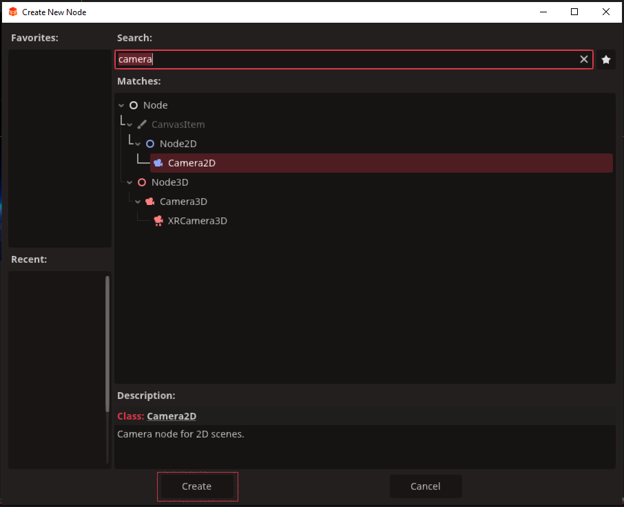

# WASTE INVADERS
## 2D beginners track

Waste Invaders is a 2D shooter where you pilot a waste management spaceship tasked with shooting down garbage raining down on the earth. It is a simple 2D project which is ideal to learn the game development pipeline from start to finish.

We cover everything from how to set up your first project and scene, all the way to exporting your finished product. You can follow along, with assets we have provided or make your own. Either way you'll have a lot of fun learning how to make this exciting game.

## Just Starting?
If you're just beginning, follow the tutorial on how to make your first project and create your first scene with `Redot` And then come back to this track.
::: info recommendation
We recommend that you name your project something similar to 'waste invaders'
unless you have a cool name in mind.
:::
[Create your first project](/pages/tutorials/create-your-first-project)\
Once we have set up our project we will want to create our first scene, to learn how to do this, follow the tutorial below and return to this track when you are ready.\
[Create your first scene](/pages/tutorials/set-up-initial-3d-scene)
Creating our first scene is the first step in the door towards our finished game. Though a small step, remember;

_One who moves a mountain begins by carrying away small stones._

## 2D World Essentials
Our first scene will need a few things before our game will run. Initially most 2D games need the following:
* a useable screen resoultion
* a 2D camera
* an awesome background

Lets start with setting our game resolution.
Ideally `1920x1080` is a good place to start, because it is the most common resolution used on desktop PCs as of 2025.\
Click `project`, then `project settings`


Click `Display` on the left and it will show our game's current resolution under `Size`. Change settings `viewport width` to 1920, and `viewport height` to 1080. We can leave the `Mode` set to windowed for the time being.


Now we can close the project settings. It's time to create a `camera2D`. We can add this by right-clicking our new scene `Main` in the top left and adding a child node


This will open the Create New Node panel. Type 'camera' into the searchbar, press enter, then select `Camera2d` and click `Create`.



This camera will give the player something to see our cool game world through, but right now there isn't much to see. Let's fix that by adding a background. Just like the camera, add a new node, but this time type `Sprite2D` into the search bar.

We are going to have many sprites in our game, so it is worth naming them in a way we can tell what they are, and what they're there for. In the scene tree, right-click the `Sprite2D` and select rename, otherwise you can press `F2`. Change the name to something obvious like 'background' or 'backdrop'

The background in 2d games is very important. As our camera is going to be fixed in place, a `sprite2D` will suffice. Our game can use anything from just a block of color, a photograph of a blowing desert scene, or the earth and stars like our example asset. Ideally you want your background to be the same size as your screen resolution, so there are no blacklines down the sides or stretching going on.


Feel free to use our background asset above by shrinking your browser to a smaller window, and while on our website, drag the image from the browser into the `Redot` `FileSystem` bottom left.


It may come with a strange name so rename it to anything you like.

We have one last thing to do, add the image to the sprite and centre it correctly. You may also want to change the `Modulation` as well. Some background images can be very loud, and no one wants their background overpowering everything. For all this and more, check out this tutorial, 
[A quick word on sprites](/pages/tutorials/a-quick-word-on-sprites) then return to this track

once you have assigned an image to our `background` sprite and checked the `centered` box we can take a first look at our game.

Press play above the inspector top right to run a test of the game.

If all was setup correctly, we should just see the background image.\
If so, congratulations! Your game has run successfully for the first time!

## Our First Lines of Code

Now we have the basics set up and ready for play, we need some functionality in the form of code. A good way to get started is to look into the GameManager tutorial. This will help you set up our two manager scripts that will be essential to our game's function.

Once you've learnt all you can from the [GameManager Tutorial](/pages/tutorials/game-managers), return to this track.

To get our two new managers ready for our game, open your `GameManager` script and delete everything except the `extends node` line. From here we want to add these two lines of code, highlighted below:


`GameManager.gd`
```gdscript{3,4}
extends node

var isGameRunning : bool = false
var level : int = 0
```
Our two lines of code achieve the following:
* `isGameRunning` - will be our gamestate, we only really need to know if the player and enemies can move or not.
* `level` - this is the level number, our game will create enemies on levels 1 - 5, but 0 will be our mainmenu

Next lets open the `LevelManager`. Once again we shall delete all the code there except for the top line. Then add these lines of code, highlighted below:

`LevelManager.gd`
```gdscript{3,4}
extends Node

var playerOrigin : Vector2 = Vector2(0, 465)
var enemyOrigin : Vector2 = Vector2(0, -830)
```

These two lines state where the player and enemies are going to start the game. The Player's `y:465` is around the bottom of the screen. The enemies `y:-830` is quite far above the top of the screen. The `x:0` for both is the centre of the screen. This is on purpose as we want the enemies to spawn out of sight, and appear to fall into the screen like they're breaching the earth's atmosphere. 

Excellent work!
We now have a working gameState so we can tell whether the game is playing or not. We know the level we are on, and we know where the player and enemies are going to start.

## Our Fearless Player and Trash Fighter

The time has come to add our player into the game. We have a great tutorial on how to get a 2D player started with controls and all, so head over and check that out, before returning to the track. [2D Player Tutorial](/pages/tutorials/player-controller-2d)

We have supplied a few art assets if you wish to use these for your player Sprites.


You can drag these into your `Redot` project the same way you did with the background image asset.

Once you have created the basic player character from the tutorial, we're going to make a few changes specific to 'Waste Invaders'

Firstly if you want a death sprite for your player, right-click the `playerSprite` and select duplicate.


After the new `playerSprite2` appears, rename it to `deathSprite`. When we create code for this later, the image will flash for a quarter of a second when the player dies. There is an art asset we have provided of an explosion you can use.

Once done, click to hide the `deathSprite`. It is a small round white open eye circle, just after the name. It looks like a closed eye when its hidden.


Next we need to modify our player code. There are two things we need to change.
* Waste Invaders is in space and gravity will not affect the player.
* The player will be moving along the x-axis and not up and down

You'll need to delete about half of the code in player.gd. What we need to keep is shown here:

`player.gd`
```gdscript
extends CharacterBody2D

const SPEED = 300.0


func _physics_process(delta: float) -> void:
	var direction := Input.get_axis("ui_left", "ui_right")
	if direction:
		velocity.x = direction * SPEED
	else:
		velocity.x = move_toward(velocity.x, 0, SPEED)

	move_and_slide()
```

This should give our player a steady left and right movement with the left and right arrow keys. Its about time we tested this, so to do so we need to open the `LevelManager` script.

We're going to add the lines of code highlighted below.\
`LevelManager.gd`
```gdscript{3,8,9,11,12,13,14}
extends Node

var playerScene : PackedScene = preload("res://player.tscn")

var playerOrigin : Vector2 = Vector2(0, 465)
var enemyOrigin : Vector2 = Vector2(0, -830)

func _ready() -> void:
    CreatePlayer()

func CreatePlayer():
	var player = playerScene.instantiate()
	player.position = playerOrigin
	add_child(player)

```

now if we run our game we should see our player at the bottom of the screen and be able to move them right and left with the arrow keys.