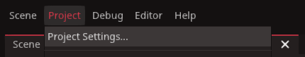
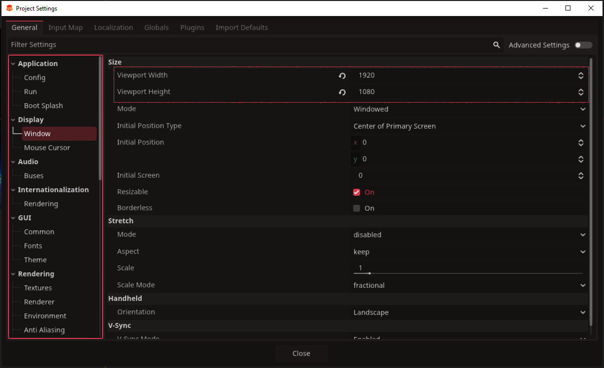
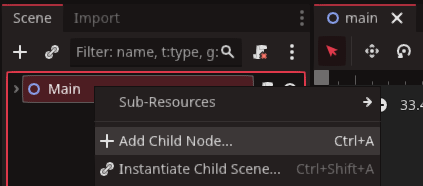
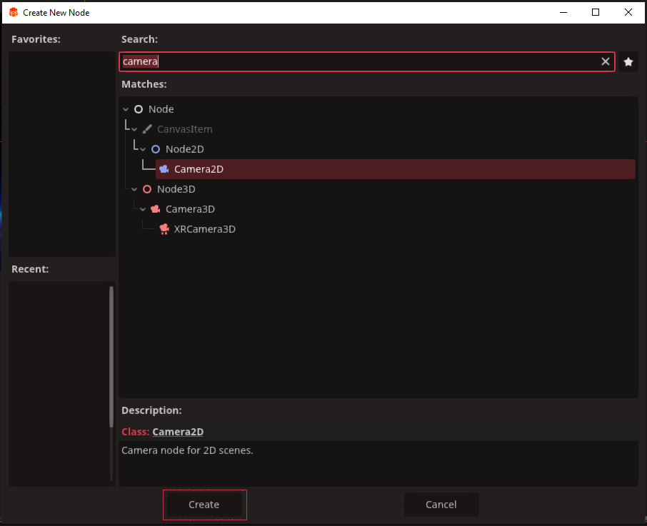

# 2D Camera setup

When setting up our 2D game's main camera there are a few things to take into consideration:

* Game Resolution settings
* The Camera2D Node

In this tutorial we will cover how to set a games resolution at project start, how to create a camera for a 2D game, and how to setup the camera so it remains fixed or follows the player.

## Game Resolution settings

A game's resolution is the width and height of the window in which the game is presented in. In `Redot` we call this the `Viewport`. When making a game, it is important to know who you are making the game for. For example, the screen resolution for a desktop PC can be flexible, while a smart phone or tablet may not.

Here are a few default resolutions to keep in mind when starting a new project from 2025 onwards.

* For desktop PC, `1920 x 1080`
* For tablets, `768 x 1024`
* For smart phones, `360 x 800`

::: info
In most cases, these resolutions are well below what each platform can handle. These are just useful starting points. It is helpful researching the platform you wish to create a game for, to see what they recommend.
:::

To set our game's resolution Click `project` in the top left, then `project settings`

For the following example, we shall assume we are making a game for desktop PC. For any other platforms, setting the resolution is the same.

Click `Display` on the left, then `window` beneath that. You will now see our game's current resolution under `Size`. Change settings `viewport width` to 1920, and `viewport height` to 1080. We can leave the `Mode` set to windowed for the time being.

Once you have set our resolution, you can close the project settings. 

## The Camera2D Node

It's time to create a `camera2D`. We can add this by right-clicking our new scene `Main` in the top left and adding a child node

This will open the Create New Node panel. Type 'camera' into the searchbar, press enter, then select `Camera2d` and click `Create`.

Our camera will be a child of `Main` scene node. This means that it will not move by itself. It is important to remember that if we make the camera a child of a different scene, it may be influenced by that node's position or movement.

This camera will be set automatically to the coordinates of `Vector2.ZERO`, the centre of your game scene. For a fixed camera setup, your work here is done. Otherwise we will have more tutorials on more dynamic setups for your camera.
