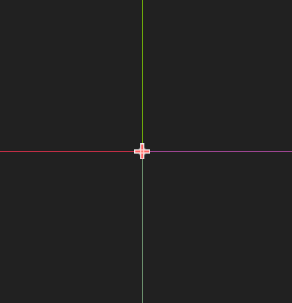
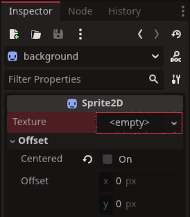

# A Quick Word on Sprites

Sprites are probably the most common image container we will use when creating some games, and `Redot` has plenty of ways we can customize them.

To begin with, the most important part of sprites are the images they show. So lets assign a texture to one now.
In the scene view a new sprite looks like this:

Before being assigned a texture they do not show up. To assign a texture the easiest way is to drag an image from the `FileSystem` over to the `<empty>` slot beside `texture` in the inspector top right. Another way is to click the `<empty>` itself.

This will show all the options for built-in `Redot` texture/image options. For this example we will click `quickload` down the bottom. Add `icon` into the search and click `open` when you find it.

All sprites in `Redot` pivot their images to their top left. If we want to centre the image with the spirtes centre, just check the `centered` box in the `Inspector`

::: tip
Be careful not the mistake the offset for the `Transform` settings beneath it. Offsetting the image, sets it away from the sprite from the sprite. The `Transform` alters the spite and the image's actual positon as one object.
:::

You can use the small red pips to adjust the sprites scale if the aspect looks wrong to you, or you wish to make it larger

If we want to offset the image we can alter the Offset setting just under the `centered` checkbox

Under the offset we have `Flip H` and `Flip V` which will flip the image on the horizontal or vertical axis.

Another important part of sprites is the `Modulate` settings located below `Transform` in the `visibility` section of the `Inspector`

`Modulate` isn't unique to Sprites, and are available to most nodes in `Redot`, but it is a quick and easy way to change sprites to our liking allow us to add color intop of the image via the sprite. You'll notice there are two different `Modulate` settings. Here are the their differences:

* `Modulate` alters the color base of the sprite and all child nodes under the sprite  
* `Self Modulate` alters the color base of the sprite only, leaving all child nodes unaffected.

When you know which setting you want, clicking `Modulate` or `self-modulate` will bring up a color palette, which if you've worked with any computer drawing software, will look familiar

Here you can move the circle in the middile around to find the color you want, type in the RGB numbers, or even use a HEX code. Under swatches you can record a color for use later. The tall bar on the right is an easy way to darken the sprite if it is too bright.

There is plenty more fun stuff about sprites to explore, but this was just a quick word.