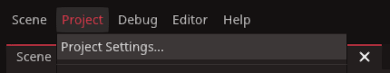

# Autoload and it's uses

`Redot` does not have global variables or static variables. But it does have the Autoload system to accomplishes many of the same tasks. This is important for keeping scores between levels, and the progress of the game across multiple scenes.

To add a script to autoload, click `project` on the toolbar, then `project settings` and lastly select the `Global` tab

In this panel we create and name any script we wish to autoload.

click the file icon in the centre to find the script you wish to add. Alongside `node name` you can choose the name you want to use when referencing it in code. It is best to keep it the same as the script. Then once you click `Add`
it will be added to the list of scripts to autoload.

::: info
The game will load the autoload scripts in the order they appear from top to bottom. If you wish to change the order, just click and drag, or click the up and down arrows on the right.
:::

When your game first launches, the Autoload scripts will be created in a singleton fashion attached to their own nodes straight at the root. These nodes are not attached to the other scenes, this is also how they remain alive when other scenes are being deleted and loaded. Becasue we can control the order in which these scripts are loaded, we can follow a linear path in our script functions.

## When to use Autoload and when not to

Autoloaded scripts should be used sparingly. In larger games you may require several manager scripts handlings everything from Enumerators to Audio settings, these are the best things to use Autoload for.
Anything that can be easily accessed by ordinary reference should remain so. Here are some reasons to use an Autoloaded script

* Contains variables and functions common to multiple scripts
* Requires variables which need to maintain progress over muiltple scene loads
* Contains variables which to reference would cause confusing or lengthy code

::: tip
It is entirely possible to create a game without the use of Autoload. Autoload is just another tool to aid us in creating good game architecture. If you do not feel the need to use them, you don't have to.
:::