# 3rd person 3D Character Controller
This short tutorial will show you how to create a Player scene with physics and a visual capsule. It is a great jumping off point for the next tuttorials on scripting the Player movement and animating the Player.

## Create your player scene
Create a new scene by clicking the :heavy_plus_sign:.

::: details why?
Compartmentalising descrete entities makes the game easier to understand and the Scene outlines clean.
:::

Select the `3D Scene` again since our Player will also be 3D.
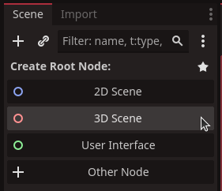

Save our new Scene by right clicking on the `[unsaved(*)]` tab and then select `Save As`.
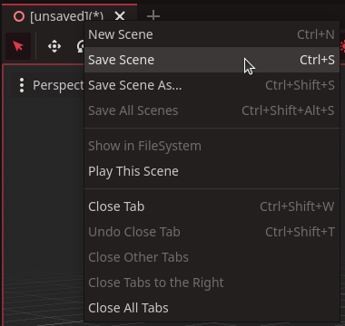

Save the new scene as `player.tscn` by filling out the `File:`field and click the `Save` button.
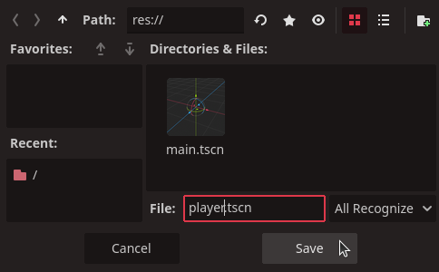

Now change the node type of `Node3D` by right clicking it and select `Change Type...`
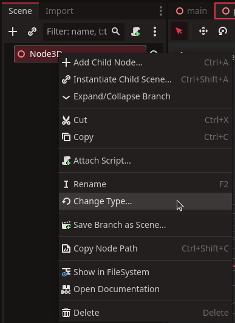
::: details why?
We need our Player scene's root node to be a special included node of the type `CharacterBody3D` that will provide most of the functionality we need to provide physics, movement and controls.
:::

Search for `CharacterBody3D` and click the `Change` button.
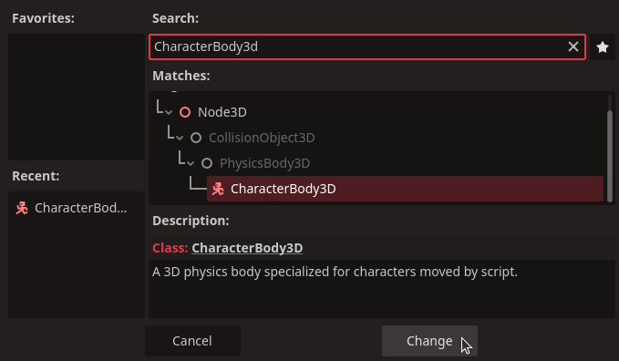

Now rename the `Node3D` to `Player`.
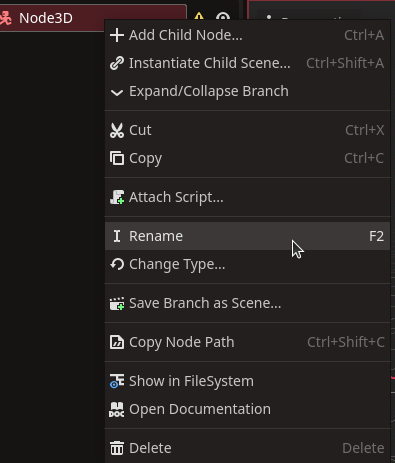
::: details why?
Naming the `root` node of a scene makes it so that when you add the scene to another, it shows up by the name you gave the `root` node. So our `player.tscn` will show up as `Player` in scenes you add `Player` to.
:::

We now have a `CharacterBody3D` with the name of `Player` and we can move on to the physical presence of our `Player`.

## Adding physics collision to the Player
Some nodes have requirements to work correctly. The `CharacterBody3D` require a shape. We define the shape by adding `CollisionShape3D` node to the `Player` node.

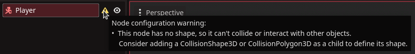

Right click the `Player` node then select the `Add Child Node`.
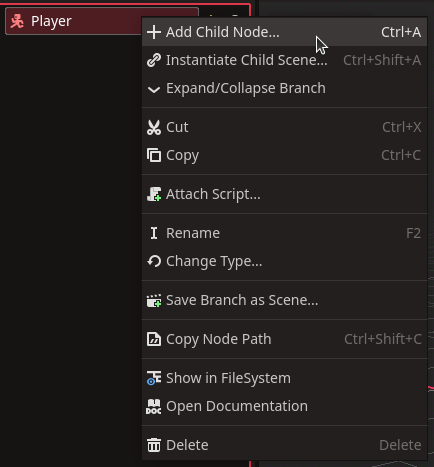

Search for collision and select the `CollisionShape3D`, then click the `Create` button.
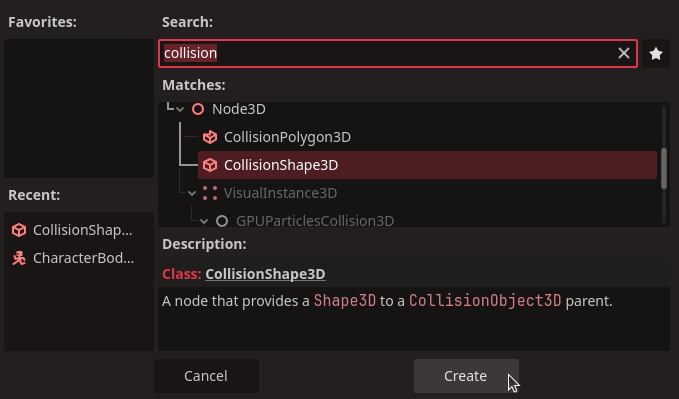

The `CollisionShape3D` node also require a specific setting.
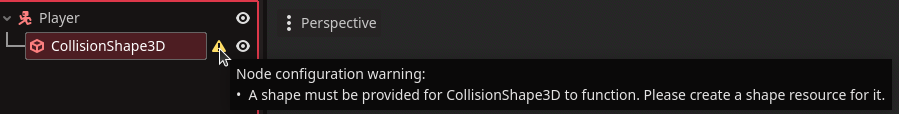

So over in the `Inspector` add a Shape to it by clicking the `<empty>` Shape property and select the `New CapsuleShape3D` option.
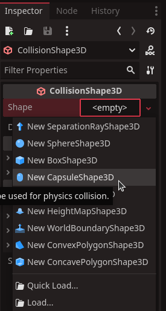
::: warning
A shape centered on it's parent like this can cause problems when placing nodes. It is better to move the `CollisionShape3D` up so it is above the origin of the root node.
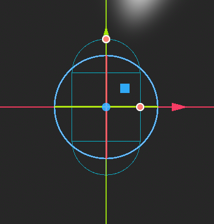

In the `Inspector` set the `Transform` to `1` on the `Y` axis.
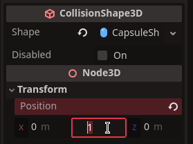
::: details why?
If the CollisionShape3D's bottom is at the Player's origin, you can place the Player on the ground in your scenes. If the collision shape is centered, the Player will not detect the ground properly and fall through.
:::

Now that we have provided a physical presence for our `Player` we can move on and add a visual resprentation.

## Add a visual shape to the Player
Right click the `Player` and select the `Add Child Node...` option.
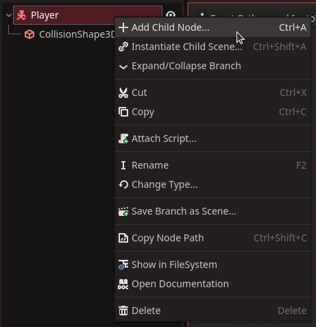

Search for `Mesh` and select the `MeshInstance3D` option.
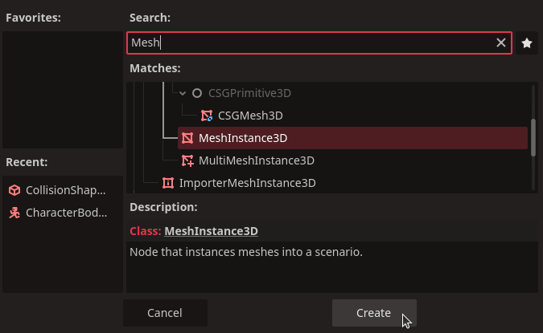

Over in the `Inspector` we add a `New CapsuleMesh` by clicking the `Mesh` property with `<empty>`, then selecting the `New CapsuleMesh`.
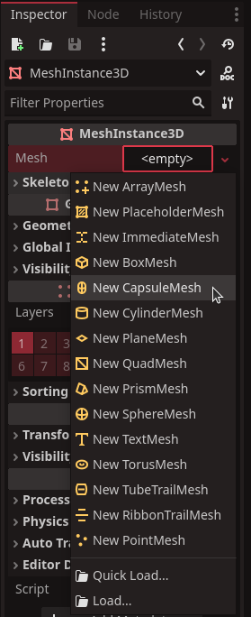
::: warning
The MeshInstance3D is unaligned with the `Player`'s physical presence.
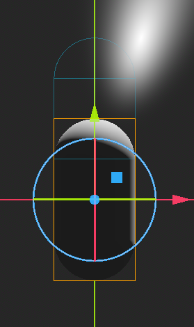

So let's align the `MeshInstance3D` with the `CollisionShape3D` by raising it by `1` unit on the `Y` axis.
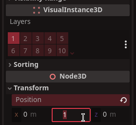
::: details why?
We set the MeshInstance3D Y position to the same as the CollisionShape3D's Y position, so that the visual mesh representation of the player ligns up with it's physical presence.

If they are unaligned the Visual component of the `Player` may phase into other physical objects because it is offset from the `CollisionShape3D`. In this example, failing to raise the `MeshInstance3D` would make the `Player` look like it is half way in the ground.
:::

Now that we have a visual representation of our `Player` we can add a camera to the our scene.

## Add the Camera to the Player
Add another child node to our `Player` root node. Right click the `Player` node and select the `Add Child Node` option.
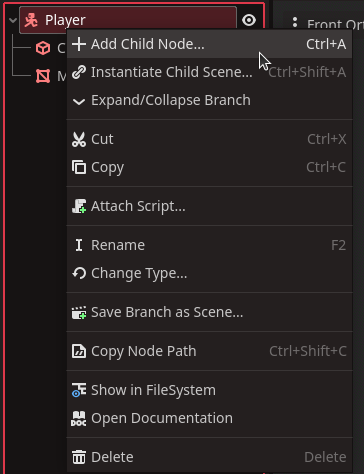

Search for Camera then select the `Camera3D` and click the `Create` button.
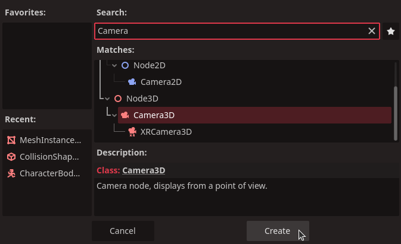

While having the `Camera3D` node selected, move over to the `Inspector` and set the `Position` component of `Transform` to `5.5` on the `Y` and `8` on the `Z` axis.
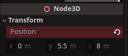

Rotate the camera down on the X axis. With the position we chose (5.5 on Y and 8 on Z) -30 degrees works quite well.
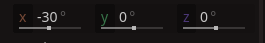

## Verify the Player scene
The Scene outline should look like this if you followed this tutorial.
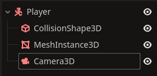

The 3D viewport should look something like this.
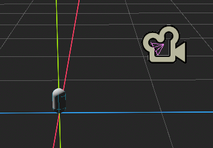

## Adding logic to the Player
Attach a `script` to the `Player` root node.
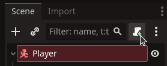

In our case we can leave everything as default here and click the `Create` button.
This will result in a `player.gd` script containing a class extending `CharacterBody3D`
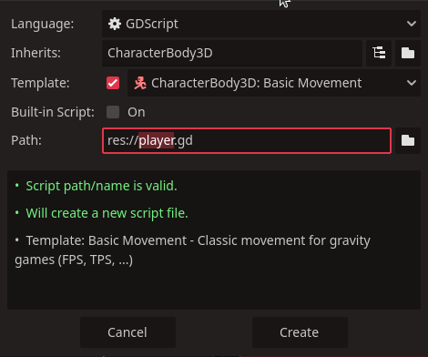

Now edit the script by clicking on the `Player` node's script icon.

If you followed these steps you should now see a `Script` window in the middle with the contents of
the `player.gd` script. The script should look like this:

::: code-group
<<< @/assets/code/player.gd{python:line-numbers}
<<< @/assets/code/player.cs{cs:line-numbers}
:::

As you can see the class isn't very large and it only defines two constants and a method
to be executed once on every physics frame.
The important part for us here is the lines:

:::code-group
<<< @/assets/code/player.gd{10-11,14-15,19-28 python:line-numbers}
<<< @/assets/code/player.cs{11,14-17,20-23,27-41 cs:line-numbers}
:::

That is the code that will handle the user input and move the character accordingly.
First there is a snippet of code that make the `Player` fall if `Player` isn't on the ground.

Then we handle input of `ui_accept` to see if we should apply an upward velocity
for an instant, making the `Player` jump.

Lastly we get the direction the user is attempting to move the `Player` and reading
it out as a `Vector` that we `normalize` to prevent the `Player` from moving faster in a
diagonal direction.

And finally we call `move_and_slide()` to apply the velocity to the `Player`'s transform, resulting in the `Player` moving on the screen.

::: info
You need to use the arrow keys and space or enter to see the `Player` move.

You can bind the `WASD` or other keys in your project settings and use the new binds
to find the `direction` the `Player` should move in.
Look at `Assigning Keybinds` or `Customizing Player Controls` to find out how.

The Player need to be part of a scene that has a floor with a `StaticBody3D` for the `Player` to "walk" on.
:::