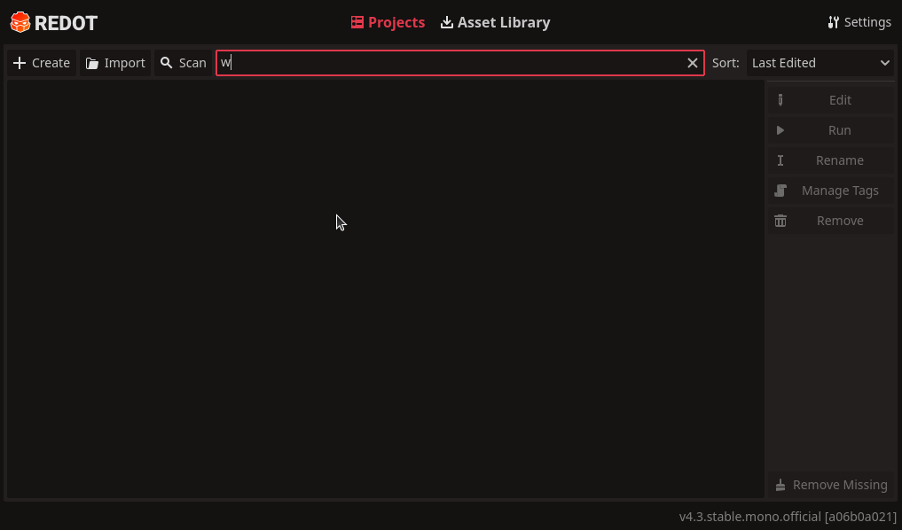
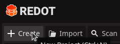
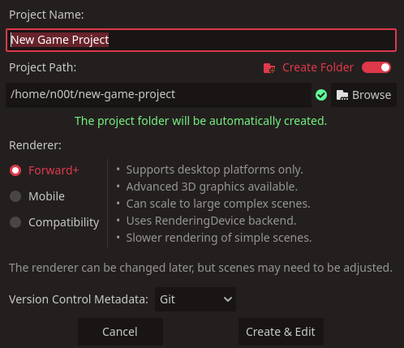

# Create your first project
When you first launch `Redot` you will be met with an empty project manager.

Your first order of business is thus to create your own project. You do that by
clicking the `Create`button.

A new window appears where you can name your project and choose where it is stored
plus a few extra settings.

::: info recommendation
It is not too important where you chose to store your projects but we recommend having
dedicated folder for your projects or at least have them in the same folder. This
will make your life a little easier when you need to reimport your projects in the future.
:::

Rewiew your settings and then click the `Create & Edit` button. This will load up the
Redot editor with your new project.
