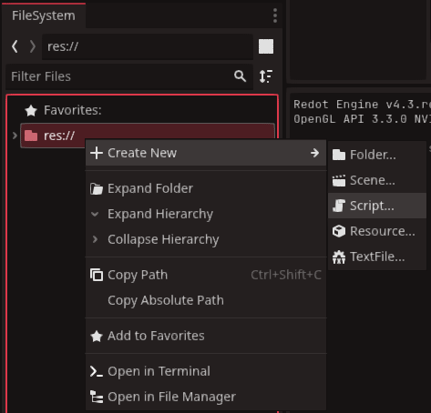
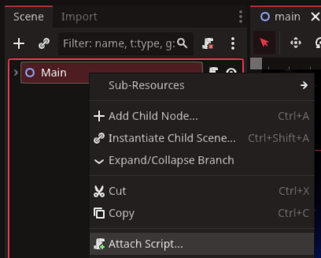

# Game Managers

What we will cover in this tutorial 

* The uses of a GameManager
* Game States
* LevelManagers and other managers

This will go over how to get the most basic functioning architecture for your game, and the best ways of managing your scripts to keep your game code clear and efficient.

## The Game Manager

It is good practice when making any game to use the GameManager script as your primary interaction when the game is launched. It is the first script to run and will coordinate the most important functions of your game;
* starting new games and gamestates
* Saving / loading data 
* scene changes
* quitting application

Let us begin by creating the script now. It's important to create the script with the `filesystem` in the bottom left, instead of the scene tree above it. 
 


We do this is on purpose, as we DO NOT want the GameManager attached to any nodes.

::: info recommendation
You have the option to call the `GameManager` anything you want, but across the game industry the name `GameManager` is pretty standard.
:::

Now we will want to add the GameManager to the autoload system, so that it can be accessed by all scripts in the game. If you need to know what Autoload is, we cover it in detail in this tutorial [How to Autoload Scripts](/pages/tutorials/autoload)

You can double-click the `GameManager` script in the `FileSystem` bottom left and it will open. Inside you will find  lines of code like the `_ready` and `_process` functions. You can delete these or keep them depending on what your game needs, but one variable you might want to consider is the `gamestate`

## Game States

A game state is a very useful little variable in our `GameManager` that lets other scripts know how the game should be wokring at any given moment. 

In practice it does the following:
* keep game characters from running around while we are in a menu
* prevent inGame actions and functions being called when a scene is being loaded, which may cause a crash
* prevent wasting memory on redundant tasks, like updating game scores while in a mainmenu screen.

A Gamestate can be as simple as a `booleon`, written in this example:

```gdscript
var hasGameStarted : bool = false
```
or for more complex states, an enumerator, where we want different gameStates to carry out different actions, like so:

```gdscript
enum GAMESTATE {mainmenu, inGame, paused, loading}
var gameState : GAMESTATE = GAMESTATE.inGame
```

## Level Manager and others

The LevelManager differs from the GameManager by being attached to the scene, and will be wiped once a new scene loads. One way to think of them, is like managers in a fast food restaurant chain.

* The `LevelManager` is a branch manager and handles day to day operations within the branch he or she is attached to.
* The `GameManager` is the CEO and handles things outside the branch and getting people to the branch itself.

::: info
`LevelManagers` are less standard in the games industry, and thus can be named different things. Some games may not even require a `LevelManager` if the game structure doesn't call for one. But a `GameManager` is always needed.
:::

Larger projects can contain several managers all handling different aspects of the game.

* Audio Manager
* Sprite Manager
* Enum Reference
* Object pooling
* Unit managers
* UI Manager
* Mouse Managers

The important thing to remember is you don't need all of these. You only should have these if they are useful. There is no standard on the numbers of managers or what each should cover.

To create a `LevelManager` right-click on a node within the scene-tree. For this example we will use the most common attached `Main` node in our scene on the lefthand side.\


once you click `attach script`, you can double click it in the `FileSystem` on the bottom left. Once again, as with the `GameManager` script, you will find lines of code like the `_ready` and `_process` functions.

Where the script goes from here is up to you