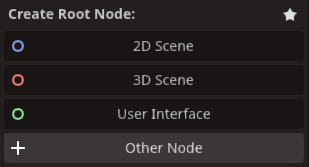
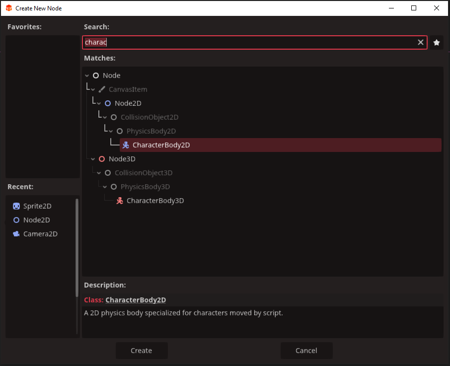
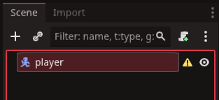
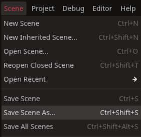
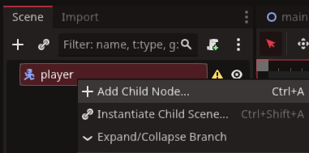
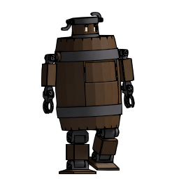
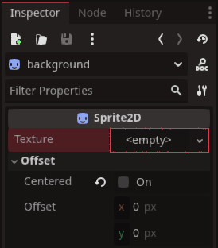
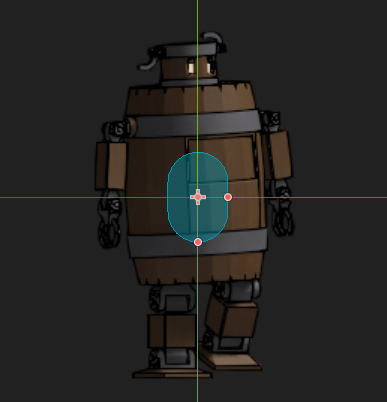
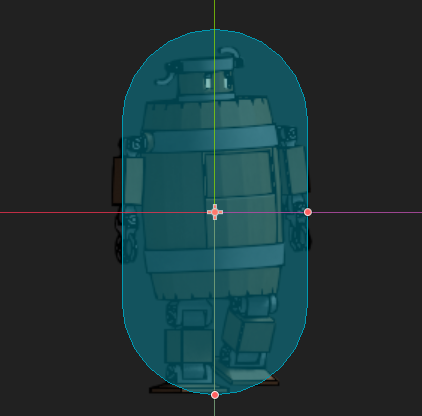
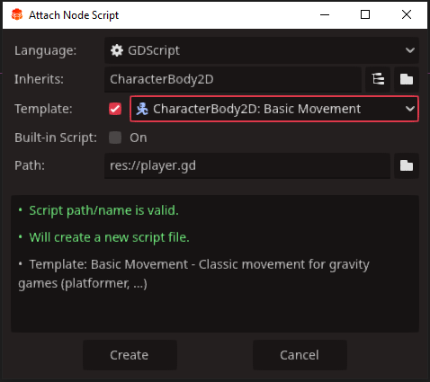

# 2D Player Controller

this tutorial will give you the basics for setting up a player chaarcters for 2D games.
Included are:
* The character controller
* the player sprites and art work 
* the player script and code for movement

Lets begin by creating a new scene by clicking the plus icon below the tool bar on the left.


Click the `Other Node` this time


In `Create New Node` panel, type 'character' into the search bar, then select `CharacterBody2D` and click `Create`


Rename the `CharacterBody2D` to 'player'



Save the scene as 'player.tscn' also



Right-click upon the `player` scene and add a child node.



Type 'sprite' into the search bar of the `create new node` panel and select `Sprite2D` and then click `Create`

Now we must decide what our player is going to look like. For the purpose of this tutorial we are going to use this 'barrelrobot' as an example, but feel free to use whatever you like.



Once you have an images you want. click the `sprite2D` under `player` and rename it to 'PlayerSprite'

Select `PlayerSprite`\
now you can either drag an image over to the `<empty>` slot under `Sprite2D` in the inspector or click the `<empty>` itself and click `Quick Load` at the bottom\
Select the image you wish to use for your player.
Unless the image is already offset, you may want to check the `Centered` checkbox so it centres


## Player Collisions

Now that we have the visual shape of our player, we can create the collisionShape so the player can interact with a 2D-world. Right-click the `player`, add a child node, and in the `create new node` panel type 'collision' in the search bar. Select `CollisionShape2D`
Now after selecting the `collisionshape2d`, we can see a panel under the inspector called `collisionShape2d`. It has an `<Empty>` slot like our sprites, only this takes shape data rather than image data. 
If we left-click the `<empty>` we get a list of shape types. 

There are a lot of diffeen shapes provided by the `Redot` engine. Ideally you want the least complex shape that cover most of the your `playerSprite`.

The one we will pick is `CapsuleShape2D` as it is the best fit for our example image, the barrelrobot. You may find the rectangle or circle works better for your own player image.
Now if you scroll back over to your player scene it shoud look something like this. 


The blue shape overtop of the sprite is the collision shape, it won't be right at the moment, but we can stretch it by grabbing one of the red pips on the side and end to reshape it to our liking.



The CollisionShape is the physicality of the characterbody2d and how it interacts with the world. If the collision shape is too small, projectiles will pass through the player, and too large the player will take hits from bullets that visually would miss.

Collision shapes don't have to be an exact size either. For example, in the your own game your player may be a jet-fighter, and you may decide projectiles would fly over or under the wings, so only body hits count. You may decide parts of your player, shouldn't register a collision at all.

::: tip
It is always a good idea to give the player more leeway in terms of hitboxes. Taking a hit from a shot that obviously didn't touch the player will annoy most gamers. Where as a near miss is generally accepted.
:::

## Basic Functionality

So now comes the time where we need to add some code so we can control our player.\
Lets start by adding a player script. To do this, right-click then `player` in the scene tree. Select `Attach script`.



Make sure the script is called `player.gd` and that the template for `CharacterBody2D` is checked. Once you click `Create` your player script is attached to your player scene, the CharacterBody2D template has provided us a default way of moving about the world as well as gravity effects.

The `#` in gdscript provides comments that do not effect code behaviour. This is so we can read comments on lines of code to explain what the template does for our player.

`player.gd`
```gdscript
#player.gd
extends CharacterBody2D


const SPEED = 300.0
const JUMP_VELOCITY = -400.0

func _physics_process(delta: float) -> void:
	# Add the gravity.
	if not is_on_floor():
		velocity += get_gravity() * delta

	# Handle jump.
	if Input.is_action_just_pressed("ui_accept") and is_on_floor():
		velocity.y = JUMP_VELOCITY

	# Get the input direction and handle the movement/deceleration.
	# As good practice, you should replace UI actions with custom gameplay actions.
	var direction := Input.get_axis("ui_left", "ui_right")
	if direction:
		velocity.x = direction * SPEED
	else:
		velocity.x = move_toward(velocity.x, 0, SPEED)

	move_and_slide()
```

This player setup is for a simple sidesrolling 2d game, but you can take this code anywhere from here.  Whether you want gravity or not, or the ability to jump or move up and down, is really down to what you want your player to be able to do. From here you can build onto the basic concept and create a truely awesome 2D game character.
