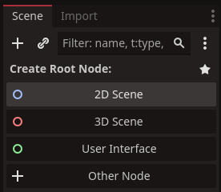
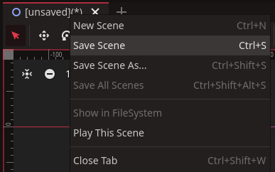
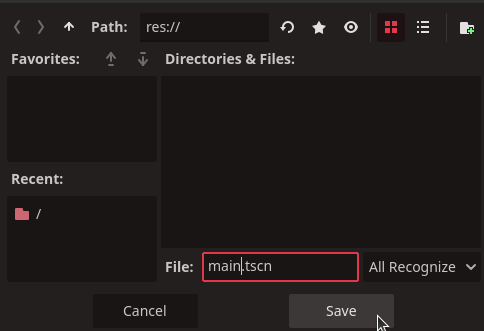
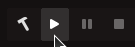
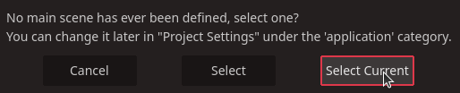

# Setting up your initial 2D Scene
Redot games require a 'main' scene and we will start by making our 3D Scene. When you first start your project you will be met with a premade empty scene and you should select the `2D Scene` here.

::: tip
Creating a scene for a 2D game is exactly the same as 3D, just click the 3D scene button instead. If you're creating a menu or UI based scene, click User Interface.
:::
We will save the 'main' scene right away. Right click the `[unsaved(*)]` tab above the viewport. Then select the `Save Scene`.

Now in the `File:` field, type in `main`. Then click the `Save` button.

And that's it! You now have a scene names main. And to make it your projec't main scene
simply click the `play` button.

And then select the `Select Current` button.

::: info
If the game started without prompting you to select a main scene, it means you
already went through this step and need to clear or set the project's main scene
in the Project Settings. Follow instructions on `Setting main scene in settings`.
:::
