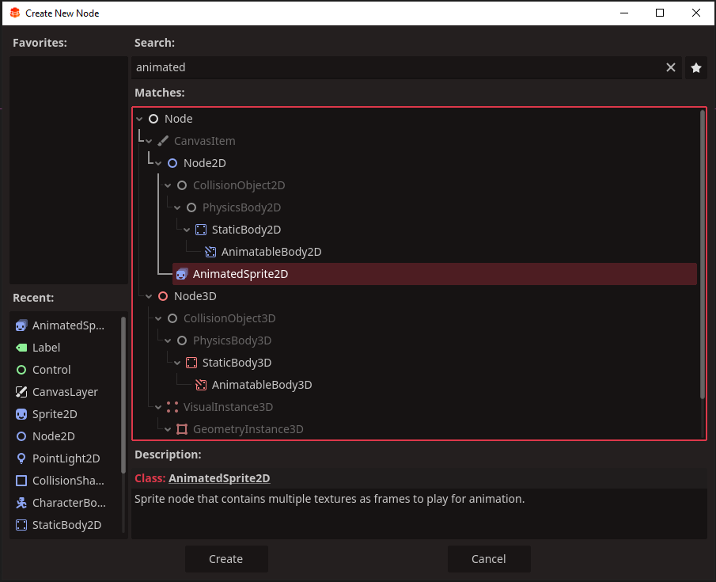

# Simple 2D Animated Sprite

An Animated sprite is exactly how it sounds. It is like a regular Sprite2D, only it cycles through multiple images or a sprite sheet at a set frames per second.

Here are just a few things these sprites are useful for:
*   Animating player movements
*   Animated enemies
*   Looped animated objects
*   Fire and special effects

In this tutorial we are going to create a simple looping campfire animation.

## Image and Sprite-sheets

The images for animated sprite can be individual files or a sprite-sheet. If the files are small the performance will be negligable, but it is best to use sprite-sheets when you can. The engine only has one image to load instead of multiple. It is also easier and tidier.

The sprite sheet we are going to use for our example. Feel free to drag this spritehseet into your redot filesystem, otherwise feel free to use your own.

## Creating an Animated Sprite

An animated sprite can be its own scene or a part of a larger one. For our example we'll use a simple empty scene with a `node2D` as it the root.\
The scene will look like this:

We will create the animated sprite by right clikcing the `main` node and clicking add child node. When the `Create New Node` panel appears, type ***animated*** into the search bar. When presented with the options we want to select `AnimatedSprite2D` and click `Create`

You will notice like any other sprite, nothing will apear in the scene until we assign an image to it. With animated sprites this is done in a different way.

First select the `AnimatedSprite2d` in the scene-tree. In the inspector, under `AnimatedSprite2D` you will see an `<empty>`. Left-click it and a dropdown will appear, left-click `new sprite-frames`

If you click the new ***spriteframes*** where the `<empty>` once was, you get a drop down again giving us the option to save the animations we are about to add. Save it as something like ***campfireAnims***.

Click the `campfireanims` and the animation panel should appear at the bottom of the screen below the scene view, like so:

### Adding sprite sheets

To add our spritesheet, click the small icon that looks like a mesh screen. It is selected in the example below.

This will open a panel that shows all our sprite sheets and other files. Select the `campirefire_spritesheet64` and click `Open`

Now we have the select frames panel. This is where we decide which frames we want from our sprite sheet and in what order.

If the images of our sprite sheet don't appear correctly within boxes the editor has provided, do not worry. The top right of the panel has all the settings we need to correct this.

We know our sprite sheet has 12 images that are each 64 pixels, they are 4 across and 3 down. So we want the following:\
`Horizontal` set to 4\
`Verticle` set to 3\
`size` 64 and 64

You may have noticed a small red outlined box at the bottom of the panel that says\
`no frames selected`.

`Redot` would like us to select the frames in the order we want them to play. We can do this now, left-click each frame on the top row from left to right, then each row after that. Here's an example:

`Redot` even numbers each frame in order for us. If you make a mistake just left-click the wrong frame and it will go away.

Once you have all 12 frames selected, you'll see the `no frames selected` button has changed to say `add 12 frame(s)`. Click it when you are ready, and the animation panel should look like this.

You should be able to see the animation in the scene view now. 

If you click the play button within the `Animation panel` you will see it play very slowly.

***default*** on the left is the name of this animation. You can click and rename if if you like, but its our only animation for this sprite, so ***default*** works.

There are three settings which we need to change before our looped animation is complete.

First is frame rate, changing it to 12 or 16 will make the animation flow better. Change it in the red box below.

Next we need it to automatically play when the game starts. Do this by checking the red box below.

Last we want our animation to loop around once its runs through. Do this by checking the red box below.

This is everything we need for a simple looping animation. There's a lot more to the Animated Sprite, but this will at least give you a footing on how to set it up and loop it.