# 2D Static Destructibles

In this tutorial we will show you how to create static destructible objects for your game. 

A Destructible is any standalone object that reacts when being collided with by another. This can be as simple as an explosive barrel like you would see in Doom, or a fixed enemy gun implacement that never moves.

The static destructible can not be moved ingame. It will not be affected by gravity, by collision, or by forced movement. If you want a destructible that can move, you probably want a rigidbody destructible, which can be found here [2D Rigidbody Destructible](/pages/tutorials/simple-2d-destructible)

We can create destructibles within our current gamescenes, but it is good practice if there are to be many of the same type of destructible to give it its own scene.

## Scene and static body creation
We start by creating a 2D scene. Click on the plus icon side our main scene or select `Scene` top left, and then `new Scene`.


When presented with the option to create anew scene, select `other`.


When presented with the `Create New Node` panel, we want to put 'static' into the search bar. 
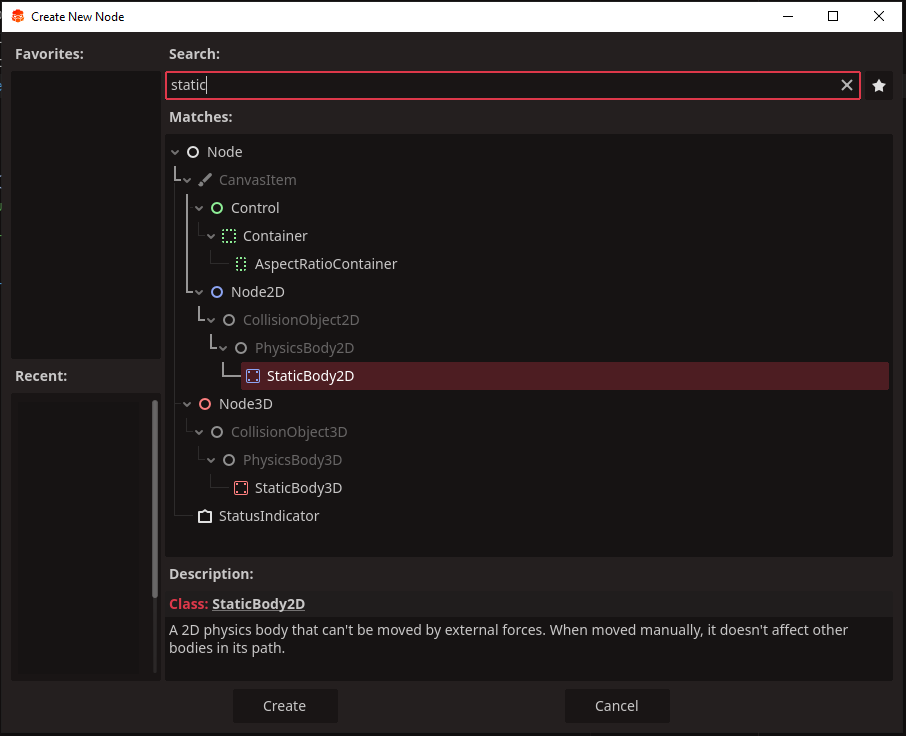
When given our options, the Node we want to create is called `StaticBody2D`. selected it and click `Create`.

If you wish, you can rename the new `StaticBody2D` as something more functional; like 'destructible' or 'barrel'. We do this by right clicking the new node under the scene tree and clicking `Rename`. alternatively you can select it and press `F2`. For our examples we will leave the name as `staticBody2D`

Now would be a good time to save our scene as well, save it as 'destructible' or the same name you chose for your `StaticBody2D`

## Main Sprite
Next we will need to create a couple of child nodes of the new scene. The first will be a `Sprite2D` node, this will represent our destructable visually ingame. To do this right click the `StaticBody2D` and click `+ Add Child Node`
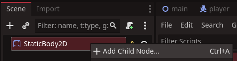

When presented with the new `Add Child Node` panel, like with the `staticBody2D`, type in 'sprite' and select `Sprite2D` when the node appears, then click `Create`.

Now we need to assign an image to our sprite, for our example we will use this crate and an explsoion image, which will be is available for you as well.

|Main sprite Image|Dead sprite Image|
|:-:|:-:|
|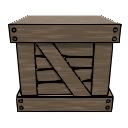||

If you're unsure how to do this, we have an excellent tutorial to get you quickly aquainted with sprites called [A quick word on Sprites](/pages/tutorials/a-quick-word-on-sprites). If you need to, check it out, then return to this tutorial.

After assigning the image to our `Sprite2D` our destructible should look like this.
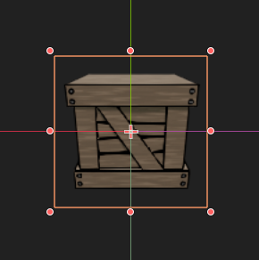


## Death Sprite
This next part is only optional. When our destructible is destroyed, we can just delete it from the game, but this example will show a simple way to present its destruction graphically.

We are going to need to rename our current `Sprite2D`, as we will need to differentiate between it and the next one. To rename this node, right click the `Sprite2D` in the scene tree and select `rename`. For our examples we will call it 'main_sprite'

Next right click our `main_sprite` and click the option that says `duplicate`.
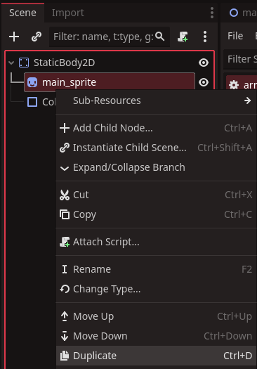

One we have our duplicate called `Sprite2D2` we need to rename it to 'dead_sprite'. You can use your own graphics for this, otherwise use the explosion image we provided earlier.

Lastly we need to assign the image to the new sprite, like we did with our main_sprite, and hide it until the destructible's death occurs. 

To hide any node, you select the little eye icon beside it in the scene tree top left.
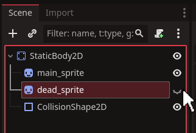

## Collision shape
the next thing we need for our destructable is a 2d shape to define the boundaries of our object. We accomplish this with a `collisionShape2D`

We create this the same way as the `Sprite2D`. Right click the `staticBody2D` and select `add child node`. When presented with the create child node panel we want to type 'collision' in the search bar.
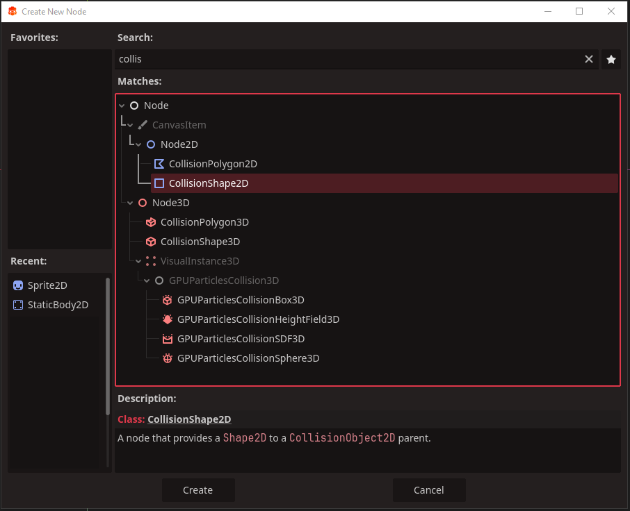
select `CollisionShape2D` then click create.

On screen nothing will have changed. This is because our collisionShape needs a 'shape' assigned one to it. We do this by selecting the `collisionshape2d` and clicking on the `<Empty>` in the inspector top right.
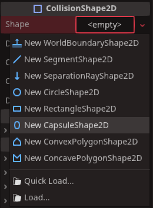

It will give us a few objects for shapes, you will want to select one that best fits the shape of the visible `Sprite2D`. For our example we will use `New rectangle shape2D`.
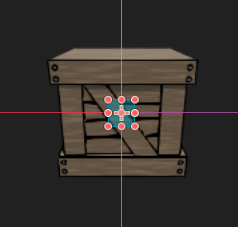

Using the little red pips, we can reshape the rectangle in blue until it covers the entire sprite.
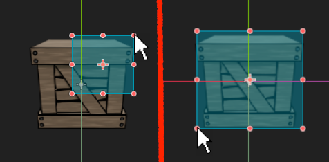

Excellent, now our destructable can detect, and be detected, when things collide with it. 

## Collision code
Next we will need some code to complete our destructible.

Right click on the `StaticBody2D` in the scene tree, the select `attach script`.
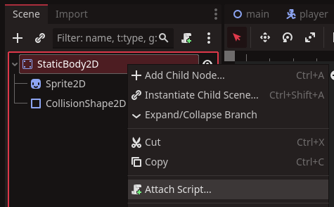
The script can be named anything, but for this example we shall call it 'destructible'.

Open the destrucible script. We will want to remove the old lines of code in red and add some new ones in green. You can remove the commented lines as well.
```gdscript
extends staticBody2d

var hitpoints : int = 3#[!code ++]


func Hit():#[!code ++]
	hitpoints -= 1#[!code ++]
	if hitpoints <= 0:#[!code ++]
		Dead()#[!code ++]


func Dead():#[!code ++]
	$main_Sprite.hide()#[!code ++]
	$dead_Sprite.show()#[!code ++]
	await get_tree().create_timer(0.25).timeout#[!code ++]
	queue_free()#[!code ++]


# Called when the node enters the scene tree for the first time.
func _ready() -> void:#[!code --]
	pass # Replace with function body.#[!code --]


# Called every frame. 'delta' is the elapsed time since the previous frame.
func _process(delta: float) -> void:#[!code --]
	pass#[!code --]
```
The variable and two functions do the following:
* The `hitpoints` variable will record how many hits the destructible can take
* The `Hit()` function is called when a collision is detected. It automatically deducts a hitpoint, then checks if the number has reached 0.
* The `Dead()` function is called and shows our `dead_sprite` for a quarter second, then deletes the destructible from the game

:::warning Important
The name of the sprites following `$` must be exactly the same as the names in the scene tree. If you named your `dead_sprite` something different, like 'dead' for instance, the code must be written as `$` and then the name. `$dead.hide()`
:::

That is our 2d destructible complete. There are plenty more things we can do to make an more advanced versions of this game object, but hopefully this will give you a basic framework to build upon.