# Simple 2D Particle explosion

In this tutorial we will learn how to create a self contained explosion scene that appears and detonates and removes itself from the game.

The first part of the tutorial covers the basics of CPU particles systems in 2d. The second half covers sound effects, lighting, and code that often go along with an explosion effect.

Along the way we will learn:
*   the cpu particles system in 2d
*   code to delete the explosion node.
*   light and sound for effect

In our example, we will begin with an empty scene containing `node2d` we have renamed to ***boom***. We will also be saving the scene as ***boom*** for ease of access.

::: info recommended
Naming conventions aside, you can name this scene whatever you want. If your game has multiple explosion effects, it is best to use a name that describes what they do. 
For example, ***bullet_puff***, or ***fire_explosion***.
:::

## CPU Particle System 2D

To begin we should create a particle system. Right-click the `boom` node and select ***add child node***. When presented with the `Create new node` panel, type ***particle*** into the search bar.
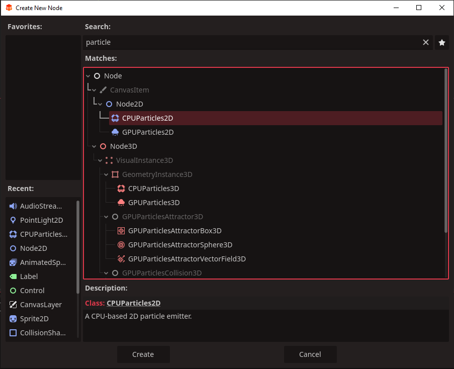

We want ***CPUParticles2D***. Select it and click `Create`.

Select the particle system and in scene view, you will notice a bunch of very small white dots travelling down very fast.
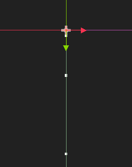
This is normal. This is the default setting, as we haven't set anything yet.

Everything we do with our particle system is on the right in the inspector.
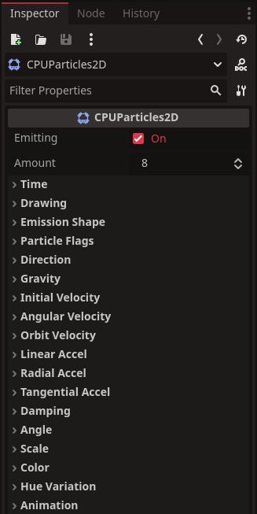

It may appear complicated and particles systems often are. But, never fear. We will go over step by step each setting we use. This way we can get a basic understanding of how 2d particle systems work.

The first thing to learn is, despite having a lot of settings, we almost never use all of them.

Our simple explosion will use the following:
*   Amount
*   Time
*   Particle flags
*   Direction
*   Initial velocity
*   Scale
*   Color

### Particle Emission and Amount

At the top of the inspector you'll see two settings ***Emitting*** and ***Amount***.\
***Emitting*** - whether the particle system is emitting particles or not\
***Amount*** - the amount of particles created in one emission cycle.

We want a lot of particles to fly out when we destroy something, so set ***Amount*** to 75. You'll see the increase in particles in the view scene.
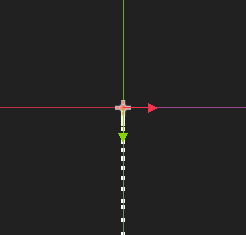

### Particle Time

Next if you left-click ***Time*** it will show all the settings regarding particle timing. We will want to alter a few of these.

***Lifetime*** - how long a particle will exist for. Set this to 0.75\
***One-shot*** - sets to one emission cycle, better for explosions. Check this.\
***explosiveness*** - sets all particles to emit instantly, instead of gradually. set this 0.9

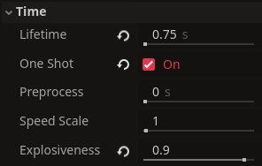

Now you will see all of the particles have dissapeared. This is because of the ***One-shot*** setting. if you click ***emitting*** at the top to ***On*** right now, it will play a single emission cycle, this will be how we test our particle system.

Click it now and you should see all the particles come out in a short burst.
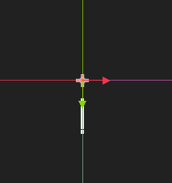

Next is the setting ***particle flags***. When you click this you will see it has only one option, ***Align Y***. Check this ***On***. This is an important setting, as it aligns all particles with their direction of travel.

### Particle Direction


If you click ***Emitting*** Right now, we won't see any change. Once we get a circular explosion going, you can turn it off and see the difference is quite noticible.

Next is ***Direction***. Clicking this, you will see settings called ***Direction*** with X Y fields and ***Spread***.
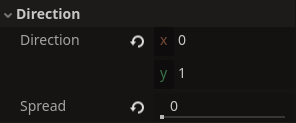

***Direction*** - emission directon for the particle system. Set both X and Y to 0
***Spread*** - the direction range of each particle. We want a whole circle, so set to 180.

### Particle Velocity

Next we want to select the ***Gravity*** tab and set both X and Y to 0. As Waste Invaders is in space, gravity will not be affecting our explosions.

This will have killed off any movement from the particles in our particle system. Don't worry, this is normal until we set set some velocties.

Now we want to open ***initial velocity*** This will set the speed of our individual particles when they are created.
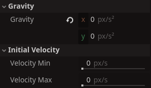

Set the ***Velocity Min*** to 75 and ***Velocity Max*** to 125. That should give our particles a bit of variance in their speeds.

If you click ***Emitting*** now, you'll see the particles are beginning to look like an explosion.
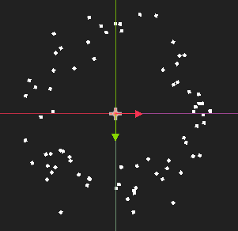

One problem we have, our particles are too small. So we shall correct his now, but clicking the ***Scale*** tab.
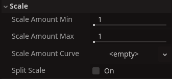

Since sizes are in pixels. Let's set ***Scale Amount Min*** to 6 and ***Scale Amount Max*** to 9.

If you click ***Emitting*** you'll see this is much better.
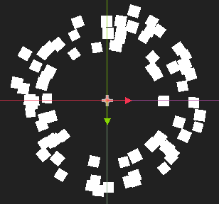

### Particle Color

The last part is the ***Color*** tab which handles the color of our particles over their life. 
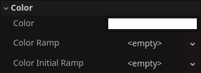

We want our particles to have an firey color and gradually fade off as their reach the end of their life. The easiest way to accomplish this, is with a ***Color Ramp***.

If we click the `<empty>` alongside the ***Color Ramp*** we will get a drop down. We want to select ***New Gradient***.
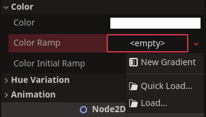

If we click the ***gradient*** where the `<Empty>` once was, it will display our new ***Color Ramp***


This gradient represents the color of our particles over their lifetime. They start black on the left side and slowly become white. We are going to change this to suit an explosive particles.

First, left-click in the centre of the gradient. This will create a third bar where we click. 
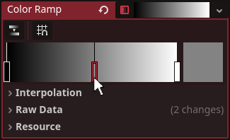

This is important as we want the particle to go through three colors not two.

Left click the left bar and then the black box besides the gradient, it will present us with a color palette. You will recognize this as simiar to the one we've used before in sprite2D coloring. 

If we drag the tall bar on the right side of the palette we can change the black to white. Alternatively enter ***ffffff*** into the `Hex #` field.
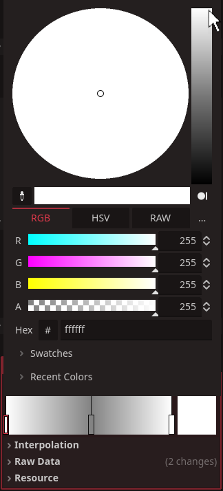

Next select the middle bar we added and open the color palette. We want our particles to start white hot and then slowly cool to a burning orange. Choose an orange color you like, or enter ***fea94c*** into the `Hex #` field.
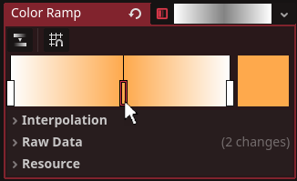

The last part of our particles life is to turn black and fade into oblivion. 

Select the last bar and change it to black. In the palette also, there is column named `a`. This represents alpha or transparency. Drag this all the way to 0.
Alternatively type ***00000000***, into the `Hex #` field. It must be 8 ***0***s or there will no transparency.
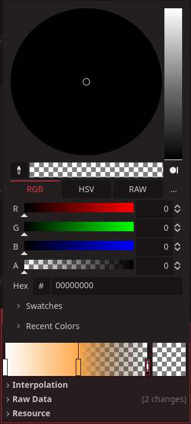

Now if we click ***emititng*** we will see our particles now go through a range of hot to cold and fade out at the edges.
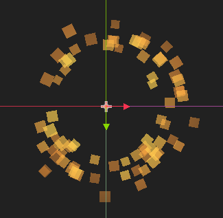

If this was all you wanted was a simple explosion particle system in 2d congratulations, you are finished. 

But if you're wanting to know what else you can add, to make your explosion more immense, keep following the tutorial below.

## Boom code

We are going to attach a very small script to this scene. Right-click the ***boom*** node int the scene-tree and select ***attach-script***. Name the script ***boom*** to keep everything the same. Open the script and remove all the red lines and add the green ones.

```gdscript
extends node

# Called when the node enters the scene tree for the first time.
func _ready() -> void:
	pass # Replace with function body.#[!code --]
    $CPUParticles2D.emitting = true#[!code ++]
	await get_tree().create_timer(1).timeout#[!code ++]
	queue_free()#[!code ++]


# Called every frame. 'delta' is the elapsed time since the previous frame.
func _process(delta: float) -> void:#[!code --]
	pass#[!code --]
```
This simple script will trigger the particle systenm to begin emitting, then auto-delete our explosion exactly 1 second after we call it in. 

This is important as we will have many explosions going off in our game, and we don't want to weight it down with heaps of ***boom*** nodes that no long do anything.

## Boom Light Source

Next we want to create a light scource, right click the `node2d` we have just created in our new scene. right-click and select ***add child object***. When presented with the `create new node` panel, type ***light*** into the search bar. Select ***pointLight2D*** when it appears and click `Create`.
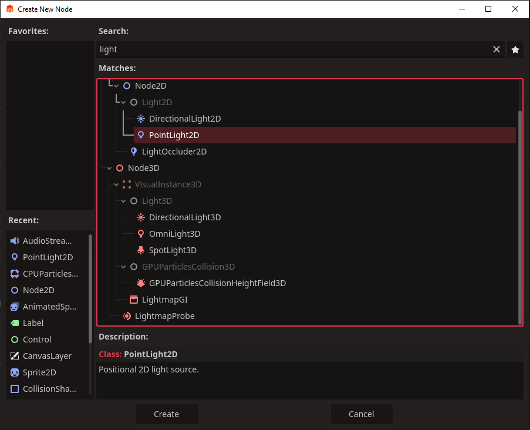

A point-light is neat little node that imitates light within 2d space. Select the `pointLight2d` in the scene-tree.

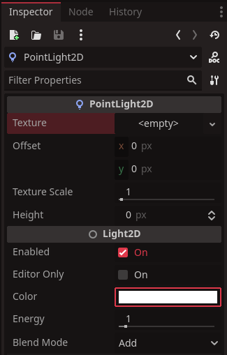
For the pointlight to be visible, we will need to assign a image to the `<Empty>` slot besides ***texture*** in the inspector. We have a light flare image which you can use below:

Just drag it into your `Redot` `filesystem` as we have done before.

There are a few things we need to change on our pointlight.
*	Texture scale - set this to 2
*	Color - click the color bar and change the `Hex #` to ***ffd695***

Excellent, once this overlaps any other textures it will light up with the light-flare image.

## BOOM Sound effect

Last we want to add a sound effect to our `boom` scene. We have provided a simple expolosion sound which you can use if you wish.\
[SOUND EFFECT : Explosion](../../assets/sound/explosion.wav)

Like our lasershot sound effect, left-click the link to download it, and then drag it from your download folder over into the `filesystem`.

Once you have done this. Drag the explosion.wav in the `filesystem` above into the scene-tree and drop it on top of the ***boom*** node.

Now open the boom script and make a space in the `_ready()` function where we can drag the sound effect into. Once you do that, don't forget to add `.play()` to it.
``` gdscript
func _ready() -> void:
	$Explosion.play()#[!code ++]
    $CPUParticles2D.emitting = true
	await get_tree().create_timer(1).timeout
	queue_free()
```

That's our particle explosion complete.

