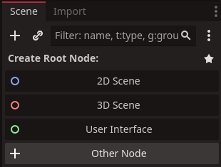

# Simple 2D Projectiles

In this tutorial we will show you how to create a projectile that moves through 2d space and interacts with objects it comes into contact with. 
This tutorial will cover the following:

* Creating the projectile scene
* Interactions with the 2d gameworld
* Assigning a script and giving it functionality

While this projectile will be simple in some respects, it has the basics required for more advanced projectiles going forward.

## Creating the projectile scene

We start our projectile by creating it's own scene. Click on the plus icon side our main scene or select `Scene` top left, and then `new Scene`.


When presented with the option to create anew scene, select `other`.


In the create new node panel, type `area2d` into the search bar, and selected it when it is displayed


::: tip Recommended
`Area2d` is not the only node we can use for a projectile scene, but it does come with many handy built in functions that make it easier to do what we want.
:::

Now once our scene is created, you'll notice there is nothing in the scene. This is normal for this node. Until we assign a sprite and polygon, there will be nothing to alter. But before that we should rename our `area2d` to something more relevant, bullet.

We do this by right clicking the area2d node and selecting rename or pressing `f2`

rename the `area2d` node to `bullet`

### Interactions with the 2d gameworld

Next we need a sprite so we can judge which part of the projecile should interract with objects it collides with. If you're not familiar with sprites yet, its worth checking out this tutorial, [A Quick Word On Sprites](/pages/tutorials/a-quick-word-on-sprites) then return to this tutorial.

Create a child `sprite2d` under our `bullet` node. Then assign an image to it, the image can be anything you like, feel free to use this plasma bolt here:


Now we can see the nasty end of our projectile! We can now create the collision shape that determines how the projectile will act. We do this by right clicking the bullet node, create another child node, then type in 'collision'. the node type we are looking for is `CollisionShape2D`. Select it and click create.

Now to set the shape for the projectile, left click the `collisionShape2d` in the scene hierarchy. In the inspector top right, you should see one of the first options is shape. If we click the `<empty>` slot beside it we will get a drop down menu of shape options.


you can choose any shape, but for this example we shall choose `Circle` because it fits our plasma bolt example.

you should have a result similair to this:


obviously the shape in blue doesn't quite fit our projectile, we can fix this by selecting the plus icon in the middile of the blue shape and dragging it upwards. Then we can resize it by dragging the small red pip on the right outwards


The important part of our projectile is the englarged head. The area shape doesn't have to cover the tail as nothing will ever interract with it.

### Script and functionality

Now we need to create some code so our projectile can move and knows what to do when it hits something.

To create a new script right click the `bullet` node in the scene hierarchy. click on `attach script` and when the panel comes up, we may as well name the script 'bullet' as well, but feel free to call the script 'projectile' or 'firedObject' if you like.

When we open the script we will be presented with a lot of code which we wont need. feel free to delete all but the top `extends Area2d` line
```gdscript
extends Area2D#[!code ++]


# Called when the node enters the scene tree for the first time.
func _ready() -> void:#[!code --]
	pass # Replace with function body.#[!code --]


# Called every frame. 'delta' is the elapsed time since the previous frame.
func _process(delta: float) -> void:#[!code --]
	pass#[!code --]

```

once that code is out of the way we can create some variables to set our projectile:
```gdscript
extends Area2D

@export var playerShot : bool = true#[!code ++]
@export var speed : float = 500#[!code ++]
@export var damage : int = 1#[!code ++]
var isDead : bool = false#[!code ++]
```

These new lines of code accomplish the following:
* `playerShot` determines if the projectile was fired by the player or an enemy.
* `speed` will be our variable for determining how fast the projecile will move.
* `damage` is the value our projectile passes onto the target it collides with
* `isDead` will be set once the projectile hits something, so it can't hit the same target more than once

next add a few spaces then add these lines in green:
```gdscript
extends Area2D

@export var playerShot : bool = true
@export var speed : float = 500
@export var damage : int = 1
var isDead : bool = false

func _physics_process(delta: float) -> void:#[!code ++]
	if !isDead:#[!code ++]
		translate(Vector2.UP.rotated(rotation) * speed * delta)#[!code ++]		
```

you might have noticed we deleted a line of code similar to the `physics_process` function earlier. It is important that we use this instead of the `_process` function as it has a more stable framerate and is better for fast moving objects ingame.

Our `if` statement checks to make sure the projectile is alive and hasn't hit anything yet.
`translate(Vector2.UP)` moves our projectile towards its forward position, so if we change its direction, it will move that way instead.

lastly we need our projectile to react to what it hits. To do this we need to create one of the functions that are part of the node. We just happen to have a nifty way to add this in `Redot`

First leftclick the `bullet` node in the scene hierarchy.


then select the `node` tab besides the `inspector` tab in the top right of the screen. This opens the panels on signals for our selected `bullet` node. Our `bullet` node is still an `area2d` node, so it has all the singlas assosciated with that node.


Select the signal that says `body_entered` and right-click. This will give us a few options, the one we want is `connect`.

Once you click `connect` it will open a panel titled `connect a signal to a method` as shown.


You can use to connect many of a node's behaviours to functions in our script. It will automatically generate a named called `_on_body_entered` under `receiver method`. Once we click connect, this function will be created automatically in our script, and the enterbody behaviour will trigger this function.

Now if we go into the `bullet` script, the new lines of code there should look like this:
```gdscript
    func _on_body_entered(body: Node2D) -> void:
        pass
```
We're going to add a few lines of code so our projectile lets its target know it has been hit, then it shall delete itself.
```gdscript
 
    func _on_body_entered(body: Node2D) -> void:
        pass#[!code --]		
	    if !isDead && body.has_method("Hit"):#[!code ++]
            isDead = true#[!code ++]		
		    body.Hit()#[!code ++]		
		    queue_free()#[!code ++]		
```
Our new lines of code do the following:
* if checks `isDead`. If the projectile is 'dead', we don't want it called again.
* if checks `has_method`. Makes sure the function we call actually exists otherwise we will see a game crash when it tries to call code that isn't there.
* sets the `isDead` boolean so the function doesn't run again
* calls `body.hit()` function on the target it hits
* calls the `queue_free()` function which deletes our projectile


That is everything we need for our simple projectile. In order to create it in game you'll need a few lines of code in the script of the node you want to fire this projectile, but that is very game specific and beyond this tutorial.
