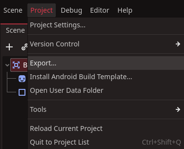
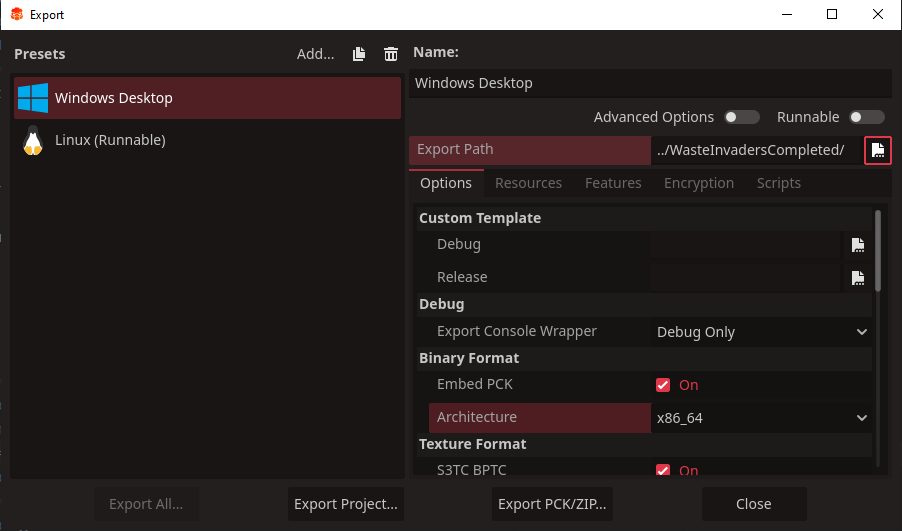
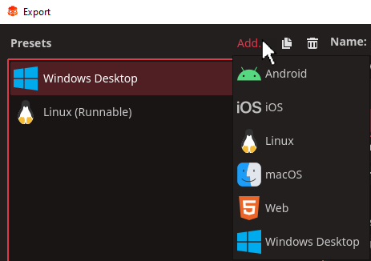
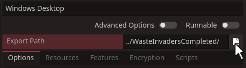
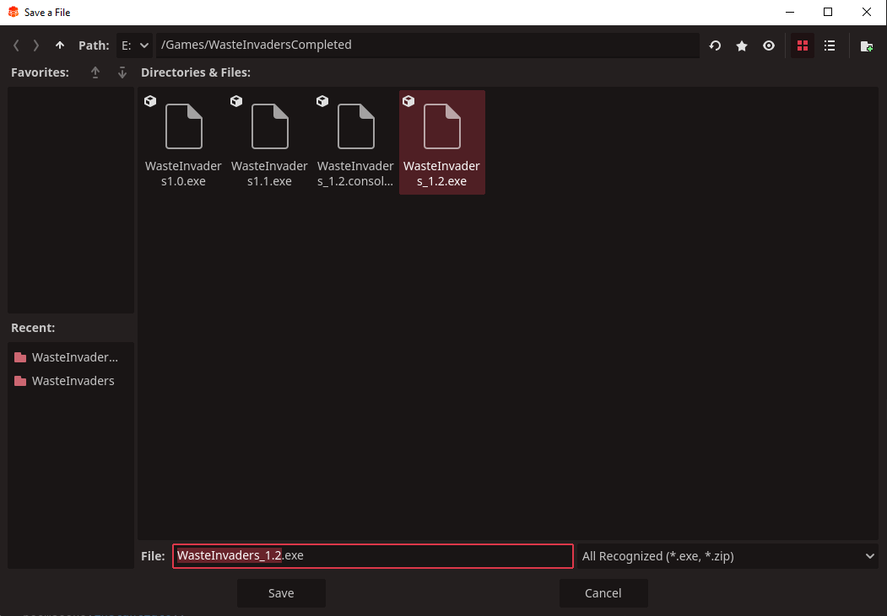
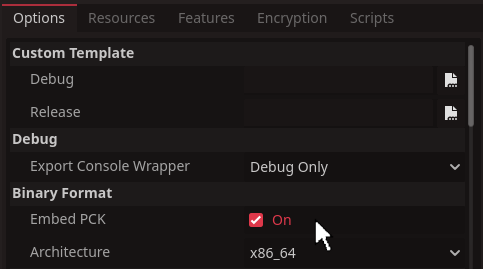

# Export your games in Windows

A `build` is like a compiled self sustaining program, that can be run though operating systems like Windows and Linux. 

Before we create a `build`, we should check to make sure everything we want is in the game. We can always create a new `build` later, but its much harder to alter a `build` after it is completed.

To begin click ***project*** on the `toolbar` and select ***export***.

When presented with the export panel, we have a lot of options. Most of these we will not need for our game.

First we need to choose the operating platform we want our game to run on.

In our example above, we have Windows and Linux already displayed. If nothing is there, you simply select `Add`

`Redot` has plenty of presets ready to set up to build our game. For our example we will want to use Windows.

The first thing we need to do is set where our build will go and what it will be named. This is done by clicking the file icon at the end of the ***export path*** field. 

This will bring up a familiar file save window, where you can find the folder you want, and what to call your build.

:::info Recommended
It is a good idea to number your builds with versions, so you know which is most recent. This can be as simple as 'mygame1', 'mygame2', or more elaborate with 'v1.21'.
:::

There are two more settings we will need before we make our first build. Under the ***binary Format*** you will see two settings.
*   Embed PCK
*   Architecture

To keep things simple we want to check the ***Embed PCK*** so everything is in one file.

For ***Architecture*** you will see a drop down menu with two options.
*   x_86_64 - for most projects
*   x_86_32 - for oler 32 bit operating systems

In most cases, you will want ***x_86_64***, unless you know for sure your operating system uses an older 32 bit format.

Once you have set those two, we can export our project. If you click `export` at the bottom of the panel. It may once again ask you toconfomr the file name and location, if it does click save.

You should now find your exported game in the folder you set.

:::info final note
Despite being designed for windows, this preset will build the game in x_86 architecture. This can run on many operating systems, not just windows.
:::