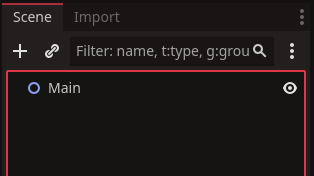
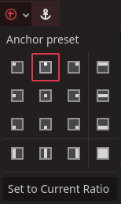

# Simple 2D Game HUD 

A HUD or ***Heads Up Display*** is a type of ***user interface*** that overlays the game camera to provide information to the player at runtime. This can be accomplished through graphics, text, or just numbers.

A HUD can be used to display the following:
*   Players health - text
*   Selected weapon - usually image
*   Remaining rounds in a weapon - text
*   Current score - text
*   Current location or level - image or map

This tutorial will give you the basic starter for a HUD which you can then add to.

## The UI nodes

The nodes required to start a HUD can be part of a level or their own individual scenes. For our tutorial example we will be adding a HUD to a simple scene that already has a `Node2D` that is named `Main` to represent an establish game scene.

We begin by right clicking the `main` node and clicking ***add child node***.\
In the `Create New Node` panel, type ***canvas layer*** into the search bar. Select the `CanvasLayer` node, then click the `Create` button.

The `CanvasLayer` node is a container for all UI or HUD related things that render ontop of the ingames graphics. In more advanced games it may be desirable to have many canvas layers to control very different interfaces.

Next we need a `control` node. Select the `canvasLayer` node, right-click and click ***add child node***. When presented with the `Create New Node` panel, type ***control*** into the search bar. Select the control node and click `Create`.

The scene tree should look something like this:

We will want to rename the control node to ***HUD***. To do this, Right-click on it and select ***rename***, or select it and press `F2`

In our scene view, you'll probably see this small orange rectangle has appeared like in our example below.

This rectangle represents our HUD's boundaries. Obviously it is too small as it is. We could just manually change its size by adjusting it, but the best way is to use the panchor presets buttons located at the end of the tool bar.

If you left-click the round green button, a drop down menu will appear.

The drop down shows all the ways we can set the control nodes to anchors around the viewport. For our HUD we want the bottom right option, this will stretch our control node to cover the entire viewport no matter what size it is.

You'll see the orange rectangle is much larger now, and represents the viewport more accurately. Anything we add to the HUD as a child node will be overlayed across the entire camera viewport.

Now we will add our first UI element to the HUD node. We will create a ***label*** which is a text container and will print text across the screen where we set it.

Right-click our HUD node and click `Create child node`. When presented with the `Create New Node` panel, type ***label*** into the search bar. When you see the ***label*** node appear, select it and click `Create`.

Since our label is placed where a scoreboard would be, we should name it something similar. Right-click and select ***rename*** or simply press `f2`. For our exampole we will name the label ***label_score***

The label will be presented in screen by another orange rectangle. We want to orient the text to the top centre of the screen. We do this the same way we set
the HUD, by selecting the anchor presets button.

You'll see the label shift along the very top of the HUD.

Now we have anchored our label to the topcentre of the HUD, no matter what shape the hud changes to, this label will shift to try and align to the topcentre. This is useful when you want multiple screen resolutions for your game.

We'll make a few chnages to our label, so it says soemthing useful. Select the `label` node and type ***SCORE : 000*** into the text field top left in the inspector.

As a last addition, lets make the text a decent size. With the label still selected, left-click the `<empty>` box beside ***Label Settings***, it will present a dropdown menu. Select ***new label settings***

Click the new label settings where `<empty>` used to be, and it will present you with a panel of options to adjust our text. We want to click ***Font*** then change the field next to ***Size*** to 32

And thats the most basic form of HUD. You can see how we can add many more elements along different edges of the screen. The code which controls such elements is more game specific. You will find tutorials on that and many others in the Redot Academy.